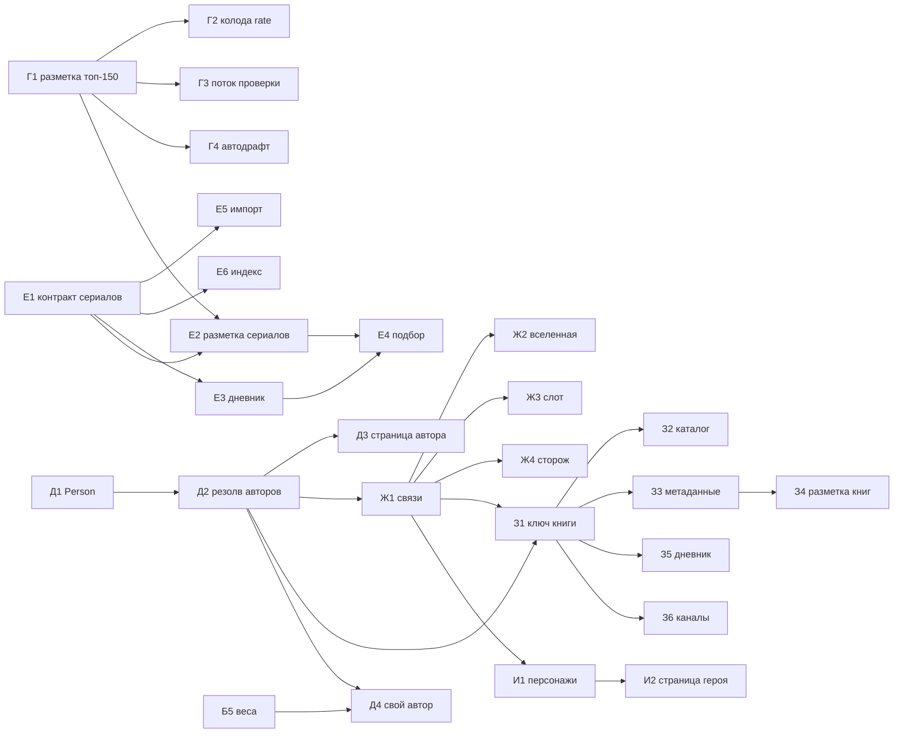

# Бэклог — Transformative Media

Обновлено 06.10.2026. Очередь с приоритетами и статусами. Замысел и объяснения — в
`ROADMAP.md` (§8), состояние кода — в `HANDOFF.md`. Берём задачи сверху вниз; закрытая строка
получает дату и уходит в «Сделано».

Размеры: S — до дня, M — несколько дней, L — неделя и больше.

## Очередь

### P0 — эксплуатация: сборщик и хвосты 29.09

| # | ID | Задача | Размер | Статус | Готово, когда |
|---|---|---|---|---|---|
| 0 | OPS-12 | Реестр в базе приложения: каналы и разметка — в базе сервера (`worker/registry.ts`), файлы — снимки (`tools/registry-lib.mts`); таблица Google — только форма ссылок, чистится в 16:00 (`tools/inbox.mts`) | M | **06.10, код готов и проверен на локальном сервере** (перенос 5911 записей без расхождений, снимок из базы = файлы байт в байт; пульт «Ссылки» берёт строки формы и отмечает их разобранными). Форма готова и проверена (таблица «Каналы», 06.10). **Ждёт владельца:** выкладка сборки на bothost, перенос на боевой сервер, `REGISTRY_MODE=server`, расписание 16:00 — порядок в HANDOFF «Реестр в базе приложения» | правда о реестре одна — в базе; ни одна правка пульта или телефона не затирается таблицей |
| 1 | OPS-5 | Прокликать значки авторов и строку поиска после правки ссылок | S | **сделано 06.10** (превью в браузере): 6 фильмов и сериалов, 29 значков авторов, 73 ссылки строки поиска. YouTube — на показанный ролик (у строки поста — на ролик того же автора об этом фильме), Telegram — на свой пост или `t.me/s/<канал>?q=<название>`; все 44 адреса Telegram открываются. Внутри Telegram ролики и `t.me/s/` уходят в браузер, посты — в мессенджер. Поиск по каналу пуст у 6 из 24 (канал о фильме не писал) — строка подписана как поиск, это честно | проверено руками |
| — | OPS-7 | Ярус 224 каналов из ссылок (`src/mocks/sources.ts`) | — | владелец, по мере разбора | — |
| — | OPS-8 | Ролик о нескольких фильмах — **сделано 02.10**: пара названий → разбор к обоим (`others` в `bestByTitle`, «Ещё фильмы» в таблице разметки); перечень из трёх и больше (новости, подборки, «сцены из фильмов …») → не разбор ни одного (`listItems`). Перечни экспертов («Кубрик») показывать отдельно — не сделано | — | — | — |
| 3 | OPS-9 | Не тот фильм: тёзки, ремейки, сравнения («Главный герой — Шоу Трумана с Рейнольдсом»). Ловушки 01.10 закрыты (односложные названия, серии, игры, сборники); остаток — по примерам | M | **06.10, третий заход** (замер: «не тот» 58 → 50 из 4449, верно 3597 → 3620, пропусков 631 → 616; индекс пересобран): тёзка по премьере, варианты названий (без кавычек, без A/An), склонение первого слова («Игры престолов»), подписи перед двоеточием, английские подписи и притяжательное, подкаст как имя шоу, теги с предлогом, ярлыки цепочкой и до конца предложения; 24 вердикта поправлены (`ops9-namesake`, `ops9-fix`). **Ждёт владельца:** импорт из таблицы (пульт, 18:52) вернул 13 строк `gap`/`corpus` с прежними ключами («Преступление и наказание» ×9, «Грозовой перевал» ×3, «Мелочи жизни») — их править в самой таблице; с ними «не тот» было бы 38. См. HANDOFF «OPS-9, третий заход». **06.10, второй заход** (замер: «не тот» 124 → 90 из 4437, верно 3383 → 3409, пропусков столько же): (1) игры — `NOT_FILM` в `title-match.mts` ловит Crusader Kings/CK2/CK3/Elder Kings, «проходим/играем», RPG, «… Plays … EP 3», «флеш игры», «игры про/по» — 55 ошибок; стримы, «AGOT» и «Игро-Мыло» сторожем не считаются: их владелец привязывает к сериалу или фильму; (2) англ. продолжение названия брало от «S1E01» одну «S» — «A Knight of the Seven Kingdoms S1E01 Explained» не узнавался; (3) поправлены 32 явно неверных вердикта (не «Проверка», а строки таблицы и принятые подсказки `gap`/`corpus`: «Грозовой перевал» 2026 ← 2011 ×8, «Дейнерис…» ← «Интерстеллар», «Вавилон» Иньярриту ← «Преступления будущего», Berserk ← «Бэтмен будущего», сиквелы ← первые части, партии CK ← «Игра престолов»). **Ждёт владельца:** 17 выпусков «Game of Thrones Podcast» о «Доме Дракона» размечены «Игрой престолов» — переставить? Остаток: «Лучше звоните Солу и Во все тяжкие» (правило «X и Y» считает продолжением), множественное/единственное («Хищник» → «Хищники», «Викинг» → «Викинги», «Персонаж» → «Персона»), обычные слова в начале заголовка («Завтра обзор…», «Дорога к краху»). Применится с пересборкой индекса. **06.10, английские тёзки**: ролики англоязычных каналов ловились на фильмы-слова (The Others, The Fool, The Queen, The Truth, The Beginning, Last Hero). `build-ordinary` теперь собирает и английские ловушки — оригинальные названия, которые в описаниях англоязычных роликов (связная речь) написаны не своим регистром в ≥60% случаев (144 названия; The Witcher — 1%, Westworld — 4%); опознаватель требует для них выделения (капс, кавычки, ярлык вроде «Explained») только в роликах англоязычных каналов. Замер на 4394 вердиктах: «не тот» 133 → 118, верных не потеряно (3355). Попутно: замер не помечал английские ролики (`en`) и занижал опознавателя — честная база теперь «верно 3354, пропущено 756», а не 2884/1259. Применится с пересборкой индекса | ошибок на ручной разметке меньше 29 из 1 196 |
| 2 | OPS-11 | Модель на привязках: первый прогон `llm-label` на Mac (локальная модель или `--model cheap`), затем «Замер» — ловит ли модель ошибки опознавателя и сколько спорит зря. По цифрам решить: спорные — только подсказка в «Проверке» или ещё и «не проверено» в индексе; пропуски, где модель нашла фильм, — в индекс с пометкой | M | **сделано 06.10, решение владельца — модель после опознавателя**: ролик канала, к которому опознаватель ничего не привязал, а модель назвала разбором одного нашего произведения, — в индекс с `evidence: 'model'` («по оценке модели» в карточке, порядок — после подтверждённых, доверие в весах 0.86). Точность таких находок на ручной разметке — 86% (197 из 229; подборки и «несколько» не берутся). Любой вердикт человека сильнее; сторожа те же (короткие, стоп-слова, сборники, раньше фильма). Как судья (спорить с привязками опознавателя) модель в индекс не идёт: зря спорит с 12% верных — только подсказка в «Проверке». Покрытие: модель размечает свежие ролики каналов каждую ночь (300); старые ролики без привязки ей не попадаются — расширить очередь `llm-label` — решить (время видеокарты) | замер: ловит больше половины ошибок, зря спорит меньше чем с 5% верных |
| — | OPS-13 | Жанры как цель ролика: модель копит темы (`topic`: жанр, эпоха, страна…) по роликам «не о произведении» и подборкам; когда наберётся частотный список — решить, какие жанры становятся страницами (как вселенные и люди) и как привязывать к ним ролики | M | копится статистика (02.10) | частоты тем в «Замере» устоялись, владелец выбрал список жанров |
| 4 | OPS-10 | 15 англоязычных обзорщиков «Песни льда и огня» (`language: 'en'`, ярус «обзор» — в приложении не видны, пока не эссе): посмотреть, что даст первый обход | S | **сделано 06.10**: 15 каналов, 1220 привязок — «Игра престолов» 540, «Дом дракона» 369, «Мир Дикого Запада» (In Deep Geek) 83, «Рыцарь Семи Королевств» 42, дальше разборы психотерапевта (My Little Thought Tree) — верные. Ошибок 33 (вердикты `from: ops10` в `markup-verdicts.json`): лор Вестероса на тёзках («Другие» ← the Others, «Выскочка» ← Night's Watch election, «Королева», «Дурак», «Тень», «Последний герой», «Правда», «Начало») → «Игра престолов»; 8 роликов «Рыцаря Семи Королевств» висели на «Игре престолов»; «Avatar TLA» ← «Аватар» 2009; подборки и случайные слова (Witness, Dreams, Nobody, Secret Garden, Guardians) — сняты. Часть ошибок стояла на подтверждениях «Проверки» 02.10 — владелец сказал, что ошибался; общий проход по 2396 его подтверждениям нашёл ещё 5 явных (Матильда, «Сокровища О.К.», Рипли на «Хищнике», «Винни-Пух: Кровь и мёд», «Хищник: Тёмные века»). Применится с пересборкой индекса | привязки к «Игре престолов» / «Дому дракона» проверены |

### P1 — Три вопроса зрителя (разбор 06.10)

Источник — отчёт «Три вопроса зрителя» (https://claude.ai/artifact/NGWt3qFpQdukMgqCCoeqCW) и решения
владельца 06.10: «почему вам» не показываем вовсе; обзоры — не запас к эссе, а рубрики восприятия со своим
местом; открытая карточка закрывается свайпом вбок, вкладки — только касанием. Порядок — по отдаче на час.

| # | ID | Задача | Размер | Статус | Готово, когда |
|---|---|---|---|---|---|
| 1 | ТВ-1 | Пересобрать индекс разборов под 4450 карточек `filmBasePopular` (справочник теперь во входах стадии «Индекс»), затем публикация справочника | S | индекс **сделан 06.10**: произведений с роликами 1217 → 1723, с постами 995 → 1546; справочник **опубликован 06.10** (2500 фильмов с материалами, 8961 материал) | у фильмов, добавленных 05.10, есть привязки; справочник на сервере |
| 2 | ТВ-8а | `researchConsent: false` по умолчанию: новый человек сейчас видит «Вы участвуете» без согласия (`src/mocks/index.ts:3915`) | S | **сделано 06.10**: по умолчанию `false`, в настройках — карточка согласия | профиль нового человека: «не участвуете», карточка согласия |
| 3 | ТВ-2 | Подбор учитывает видимый разбор: поправка в счёте за эссе при кадре; первые три кадра новому человеку — только с разбором. Объяснений выбора не выводим (решение 06.10) | S | **сделано 06.10**: `Candidate.essays` — авторы, видимые во вкладке «Обзоры» (та же группировка `groupByVoice`: без яруса review и постов, с фильтром языка); надбавка `ESSAY_BONUS` 0.04; новичку (`NOVICE_RATED` 20) первые три места — с разбором (`essaysFirst`, проверен на подставных кандидатах). В превью без сервера человек не новичок (демо-дневник), там лента — 4 из 7 с видимым разбором. Замечание: у многих фильмов все ролики — ярус review, которые вкладка прячет (решение 29.09) — с полками рубрик (ТВ-3в) они станут видимы | в первой ленте нового человека у ≥3 из первых кадров есть разбор (сейчас 1 из 7) |
| 4 | ТВ-3а | Рубрики: разметить корпус моделью (`tools/llm-lens.mts`, 12 рубрик, второй угол) | M | **сделано 06.10**: 5303 ролика; доразметка новых после пересборки индекса — тем же запуском | 5312 роликов размечены, `--report` |
| 5 | ТВ-3б | Рубрики: проверить качество на выборке (по 20 на рубрику), поправить промпт; решить, нужна ли рубрика в «Проверке» пульта | S | **06.10, второй замер**: локальная gemma-3-12b и после правки промпта держит слабые рубрики плохо (по 20: «как было» 9, «об авторе» 10, «книга» 8, «специалист» 14, «философия» 6) — путает историю съёмок с историей, лор с историей, обычный «смысл» с философией. Промпт дополнен 16 примерами из этих ошибок. Проба облачной (`--model cheap`, DeepSeek) на 40 роликах слабых рубрик — верно 34 (85%, планка пройдена), стоила $0.008; весь остаток (~450) — около $0.09, но денег на DeepSeek пока нет (владелец). Дальше бесплатно: перезапустить LM Studio (сервер завис 06.10 в 09:00) и/или подключить в llm-gateway Ollama с qwen2.5:14b (уже стоит) — сравнить на тех же 40. `llm-lens --only … --relabel` теперь переразмечает и размеченное этим промптом (смена модели). **Решение владельца 06.10:** слабые рубрики размечает сам — вкладка «Рубрики» пульта (`/lens/`, решения в `tools/lens-verdicts.json` поверх модели, сводка согласия модели с человеком; HANDOFF). Модели сравнивать по очереди, не одновременно | доля верных ≥80% на выборке |
| 6 | ТВ-3в | Рубрики: проект полок — **выкатывать постепенно, по поведению и мнению аудитории** (владелец 06.10): с наскока карточка рискует стать каталогом трэш- и грехообзоров (их больше всех: грехи — 448 произведений) или, наоборот, закрепить иерархию «эссе престижнее трэша». Порядок: (0) рубрики только в данных, интерфейс прежний; (1) замер — что открывают и досматривают по рубрикам, без показа рубрик; (2) малая доля людей видит полки, остальные — нет, сравниваем; (3) решение по результатам. Рубрики равноправны: без рейтинга рубрик, без «престижных» ярлыков, без счётчиков | M | **06.10, категории участников (владелец):** админ — владелец (`OWNER_USERNAME`): всё, включая статистику (`/stats`, петля `/loop`) и механику трансформативного обучения (карта операций, уровни, прогноз — переключатель «Показывать механику»); полки рубрик у него по умолчанию включены, переключатель в настройках выключает. Тестер — таблица `tester` (ник в нижнем регистре), список ведёт админ в настройках («Тестеры»: добавить по нику, убрать): все полки рубрик всегда, без статистики и механики. Остальные — участник: полки по доле `ROLLOUT.lensShelves` (сейчас 0), статистики и механики тоже нет. Роль — `profile.role` в `/api/state`; `/api/report/loop` и `/api/owner/testers` — только админу; адреса `/stats`, `/loop`, `/owner`, `/curator*` пускают только админа. Проверено на своей копии сервера (sql.js) и в headless Chrome под тремя ролями. Ждёт выкладки (сборка bothost — по слову владельца) | план этапов согласован |
| 6а | ТВ-3е | Язык разборов: англоязычные ролики (1892 из 6184 с рубрикой, почти все — «Игра престолов» и «Дом дракона») нужны для своего канала по сериалу и книгам; участнику — только если выбрал английский в настройках (решение владельца 06.10) | S | — | **сделано 06.10**: `materialLanguages` в настройках, по умолчанию русский; фильтр в `analysesFor`, `materialsOf`, `aboutOrder`; вес в рейтинге язык не учитывает |
| 6б | ТВ-3ж | Рубрика «О персонаже» (владелец 06.10): ролик об одном герое (или паре, семье) в одном или нескольких фильмах — арка, мотивы, эволюция, злодеи, супергерои, герои больших сериалов («Игра престолов», «Во все тяжкие»). Очень востребована | S | **заведена 06.10**: `character` — 13-я рубрика, между «Об авторе» и «О франшизе» (`lens-lib.mts`, `src/lib/lenses.ts`, `MaterialLens`, `ru.lens.name`, «Поведение»); в «Рубриках» пульта — клавиша `[`, рубрика среди слабых (идёт первой на проверку, в том числе с телефона); промпт `media-lens.md` — определение и 7 примеров, Бриенна, Безумный король — теперь сюда, Рамси и психолог о Ланнистерах — вторым углом. `llm-lens --match <регулярка>` — переразметка только подходящих заголовков: кандидатов 618 (регулярка — `tools/prompts/media-lens-character.re`) | роликов «О персонаже» ≥100, верных на выборке 20 ≥80% |
| 7 | ТВ-3г | Рубрики: **интерфейс готовим целиком сейчас, показываем минимальный без них** (владелец 06.10). Рубрика едет в индексе (`essaysAuto`) и в событиях открытия материала; полки в шторке и на странице фильма — за флагом (по умолчанию выключен, включается доле людей на этапе 2 ТВ-3в) | M | **сделано 06.10**: рубрики — отдельным файлом `src/mocks/essayLenses.ts` (id ролика → рубрика/второй угол; пишет `llm-lens` в конце прогона и `--export`, ночью — стадия «Разметка LLM», 10 минут; на сервер — справочником `essayLenses`), проставляются материалам при загрузке. Открытие материала → `POST /api/open` (таблица `material_open`: адрес, произведение, площадка, рубрика, ярус, место, полка, видел ли полки) — пишется всегда, это этап 1. Полки — `LensShelf` над авторами в шторке и на странице фильма: «Все» + рубрики в постоянном порядке, без счётчиков; с полками видны и обзоры (у них своё место). Флаг `lensShelves`: доля в `src/lib/flags.ts` (`ROLLOUT`, сейчас 0, хэш id Telegram), у владельца — переключатель в настройках. Проверено в браузере: выключен — «Джокер» как был (4 автора, без строки); включён — 8 полок, 17 авторов, полка «Грехи» — 3; открытия пишутся с рубрикой и полкой; воркер на SQLite пишет строку | с выключенным флагом карточка не изменилась; со включённым — полки работают |
| 8 | ТВ-3д | Добор каналов под тонкие рубрики: специалисты (психологи, психиатры, историки, юристы), «как было на самом деле», книга и фильм, грехобзоры | M | **06.10, замер полок** (русские ролики, обзоры на полках видны наравне с эссе): ниже 50 только «автор» — 42 (проверенных 35); по проверенным ещё «франшиза» 42 и «история» 49; остальные от 56 («франшиза») до 564 («грехи»). 951 ролик индекса ещё без рубрики. В эссеисты по слову владельца — Сценаристка, RocketMan, Black Meat Plate, Шебанов, КАРО.АРТ, My Little Thought Tree (у Шебанова и КАРО.АРТ снято `via: 'links'` — их загрузки теперь обходятся). Кандидаты под «автора» — из ссылок: TapeReviewChannel (фильмографии), Daniluck (авторский почерк), Телеканал КИНОТВ. **Ранее, 06.10:** кандидаты — по ссылкам из постов Telegram и описаний наших роликов (scratchpad `channels-candidates/candidates.md`); владелец: «все сильные» — заведены 10 (Telegram: Алексей Исаев, «Авторская комната», «Пиратский хронист»; YouTube: Олег Комолов, Faust 21 Century, Маруся Черничкина, «Скрытый смысл. Философия», «Философия Beard [TV]», «По ту сторону объектива», «Кабинет Калигари»); `youtube-channels` находит канал и по id `UC…`. Не заведён Алексей Водовозов — у него старая ссылка `/c/…` без ника и id. Комолов и Исаев пишут не только о кино — после первого обхода смотреть точность во вкладке «Каналы». **Главный резерв — уже наши каналы**: ролики тонких рубрик не привязались к фильмам (Кино-Театр.Ру «Деконструкция» 162 → 3, Why the Book Wins 330 → 1, Maximum Movie 73 → 2, ЛИТЦЕНТР ~66 → 1, Свищенков 43 → 1, «4то за Персонаж?» 57) — причина оказалась не в опознавателе: это каналы «ссылками» (`via: 'links'`), их загрузки индекс по правилу 29.09 не обходит. Переведены в голоса 14 (по слову владельца): Кино-Театр.Ру, Why the Book Wins (англ.), Maximum Movie, ЛИТЦЕНТР, Свищенков, Кинолист, Сергей Романов, Елизавета Корабельникова, «Психология кино», «Скандально Неизвестная Сценаристка», «Итак, Далия», Ася Занегина, RocketMan, proчтение; ярус — обзор, как стоял. Остальные 694 канала «ссылками» (43 тыс. опознаваемых роликов, больше половины англ.) — не трогали | у каждой рубрики ≥50 роликов |
| 9 | ТВ-4 | Шторка: вход на полную страницу из ленты и архива («Подробнее» или жест — решить), там «Где об этом говорили», «Рядом называют», статистика. Свайп вбок и «Назад» Telegram — **сделано 06.10** | S | **сделано 06.10**: кнопка «Подробнее» в верхнем ряду шторки (жест вбок занят возвратом) — во всех шторках: лента, архив, поиск; «Назад» со страницы — в ленту | с кадра ленты за одно касание на `/works/:id` |
| 10 | ТВ-5а | Обсуждения: «ещё N постов» раскрывает список (`WorkVoices.tsx:149`) | S | **сделано 06.10**: кнопка раскрывает посты автора, «свернуть» | — |
| 11 | ТВ-5б | Обсуждения: у поста кнопка «Обсуждение» → ветка комментариев канала (`t.me/<канал>/<id>?comment=…`, только у каналов с комментариями) | S | **сделано 06.10**: «Комментарии» у постов каналов с обсуждением (`tools/telegram-comments.mts` → `src/mocks/telegramComments.ts`, по полю `replies` постов шлюза: 33 канала с обсуждением, 6 без; в стадии «Посты Telegram» и ночном сборе). Ведёт на сам пост: ссылки прямо в ветку без номера комментария у Telegram нет, под постом — его кнопка «комментарии» | — |
| 12 | ТВ-5в | Обсуждения: спойлер-защита постов как у роликов | S | **сделано 06.10**: до конца просмотра вместо текста поста — замок, пост и комментарии не открываются | — |
| 13 | ТВ-5г | Обсуждения: «Где об этом говорили» во вкладке шторки; `getDiscussions` для справочника и пула (`api/index.ts:2305`) | S | **сделано 06.10**: `getDiscussions` ищет карточку как `getWork`; общий блок `screens/WorkPlaces.tsx` во всех шторках (лента, смотрю сейчас, архив, поиск) | у «Мертвеца» блок есть |
| 14 | ТВ-7 | Почистить привязки на виду: прогнать холодный старт на 5–10 типичных профилях, собрать фильмы первых лент, их привязки — первыми в «Проверку». Известные: пост о «Мертвецы не умирают» на «Мертвеце», «Hans Zimmer: Interstellar» на «Интерстелларе». Из хвоста разметки (06.10): «Домовой» 2008 ← ролики о «Домовом» 2019; «Менялы» 1992 ← «как менялась…»; «Наследники» 2008 ← посты о Succession; «Коммерсант» 1990 ← «Коммерсант» Кравчуков 2024 и газета; подозрительные «Горизонт» 1962, «Спасибо» 2003, «Тайная жизнь» 1998, «Спираль» 2014 | S, регулярно | **сделано 06.10 (первый проход)**: 12 вердиктов по роликам и 14 по постам из хвоста разметки и известных («Мертвец», «Интерстеллар», «Домовой», «Менялы», «Наследники», «Коммерсант», «Горизонт», «Спасибо», «Тайная жизнь», «Спираль»); вердикты по постам — новый раздел `posts` в `tools/markup-verdicts.json` (ключ — адрес материала), их читает `build-telegram-index`; сторож `RIVALS` для «Менял» («как менялась…»); из «Проверки» — 59 спорных `wrong`/`notfilm`/`person`: переназначено 19, снято 31, подтверждено 9; неясные оставлены владельцу. Прогон холодного старта на профилях — не сделан: в превью без сервера человек не новичок **Холодный старт, 06.10:** режим «чистый новичок» в превью (`?fresh` или `tm.fresh=1` — без истории владельца и демо-дневника, с холодным стартом), 6 профилей по колоде (блокбастеры, отечественное, анимация, авторское, хоррор, культовое; по 11–12 оценок) → 42 фильма первых лент, 31 разный. Неверных привязок на виду 12 (вердикты `from: tv7-cold`): у «Бэтмена» 2022 — ролики о трилогии Нолана, о Брюсе Уэйне вообще, «Бэтмен: Ноэль», «Бэтмен будущего» и «Пингвин» (последние два — к своим сериалам); выпуск Долина на «Матрице»; посты на «Антихристе» (фильм Германики, день рождения Генсбур, звукорежиссёр Ноэ), «Теперь по лучшим» на «Джокере», дайджест Берлинале на «Первой корове». Найдено и починено: вставка «дальше во вселенной» вставала третьей и ломала «новичку первые три — с разбором» (у всех шести третьим был фильм без разборов) — теперь четвёртой | у фильмов первых лент нет ложных привязок |
| 15 | ТВ-8б | Честные тексты: ошибки без «показываем последнее сохранённое», правильные заголовки ошибок на Voice/Person/Universe/Character/Stats, убрать служебную строку о сессии | S | — | **сделано 06.10**: «последнее сохранённое» — только когда прежняя лента на экране, иначе «Сервер не ответил…»; свои заголовки ошибок у автора, человека, вселенной, персонажа, статистики; строка о неподтверждённой сессии убрана
| 16 | ТВ-8в | Жаргон и единые термины по таблице отчёта: «кадр» → фильм, «колода» → оценки, одно слово для Архив/Дневник, Маршруты/Траектории, Разборы; темы «Тёмная/Светлая»; поиск «Фильм, сериал или книга» | S | — | **сделано 06.10**: «На сегодня фильмов нет», «Убрали из ленты», «К оценкам»/«оцените ещё N», уровень усилия без «слейта» и «вершины», вкладка «Разборы», «Архив» вместо «Дневник» (настройка «Подробный дневник» — прежняя), «В маршрутах», темы «Тёмная»/«Светлая», поиск «Фильм, сериал или книга»; «уровень N»/«без разметки» на страницах человека, героя, вселенной — только с «Показывать механику»
| 17 | ТВ-9 | Поломки: «Повторить» на Voice и в поиске; ложная пустота шторки поиска при загрузке (`WorkCardSheet.tsx:35`); колода — оценённое уходит, порядок частей; «больше десяти» при пороге 5; ссылка на бота через `openTelegramLink`; «Не сейчас» у согласия | S | — | **сделано 06.10**: «Повторить» у автора и в поиске перезапускает загрузку; шторка поиска пишет «Загружаем…», а не «никто не говорил»; колода — оценённое уходит вниз, части серии по году («Братство Кольца» → «Две крепости» → «Возвращение короля»); подсказка про пять оценок; бот из настроек — через `openTelegramLink`; «Не сейчас» у согласия сворачивает карточку и оставляет в профиле
| 18 | ТВ-10 | Картинки и мелкий дизайн: обложки пула кандидатов и страниц авторов; заглушка с названием вместо пустой плитки; цели нажатия ≥44 px; страны по-русски; неопределённые CSS-переменные; тема из настроек при старте | M | — | **сделано 06.10**: общий `WorkThumb` во всех списках — без картинки кадр-заглушка с перфорацией и буквой, битая картинка → заглушка; баннер без кадра подсвечен цветом операции; обложки страницы автора (`getVoiceWorks` через `withMedia`/`pictured`: у «ЭПИЗОДОВ» 142 из 232 с картинкой, было 0); +обложки 34 размеченным карточкам (`build-base-media`); страны по-русски (`lib/countries.ts`, `Intl.DisplayNames` + таблица, СССР/ГДР/Чехословакия); `--tm-radius-1/2/3/sm` → токены системы; тема из настроек при старте (`settingsStore`); цели нажатия ≥44 px — невидимым слоем у круглых кнопок шторки и плашек
| 19 | ТВ-12а | Просьбы в Telegram: разобрать находки ночного поиска (просьба → фильмы из комментариев через опознаватель) → набор для проверки подбора и словарь формулировок запроса | M | **06.10, весь хвост размечен** (qwen2.5:14b через Ollama, 642 находки за 79 минут, ошибок 0; всего 1776): просьб 251, с якорем «понравилось» 24, веток с советами 12; советов-названий 509, опознано 268 (196 произведений); пар «понравилось → посоветовали» 91, но из веток с якорем и ответами — только 1: ответы на просьбы ещё не забраны. В очередь шлюза поставлено ещё 75 веток (всего 195, забрано 0) — их забирает ночной search_plan по 20 за ночь. Не нашлись в справочнике: «Отец невесты», «Шкатулка дьявола», «Мой кузен Винни», «Дьявол носит прада» (у нас — «Prada», та же беда, что в OPS-9). Ранее: **идёт 06.10, первый итог**: размечено 769 из 1411 находок (остаток дорабатывает фоном). Просьб 156, с якорем «понравилось X» 14, но комментарии подтянуты только под одной («Горничная» и «Обсессия» → 45 советов) — 91 пара в отчёте это одна ветка, перемноженная; независимых наборов пока один. Под остальными 13 якорными просьбами — от 1 до 57 комментариев, под всеми 130 просьбами с ветками — 3296: их забрать — запросы шлюза (ТВ-12б, решение владельца). Словарь формулировок «чего хочу» — 115 (`want` в `.cache/tg-asks/pairs.json`): настроение («на вечер», «чтобы поплакать», «чтобы крепко спалось», «залипнуть», «не сильно сложный»), жанр, «похожее на X» — материал для переключателя силы и поиска по запросу | набор из ≥50 пар «просьба → советы» |
| 20 | ТВ-12б | Просьбы в Telegram: поиск по расписанию (10 бесплатных запросов в сутки, сразу после сброса бюджета) и список публичных кино-чатов для `search chat` | S | **сделано 06.10**: расписание поиска в демоне tg-gateway (`search_plan.py`, план `~/core/services/tg-gateway/searches/recomend.json`): раз в сутки после 00:05 UTC, до обхода, ≤ 40 обращений — 8 запросов «посоветуйте…» (2 бесплатных из 10 — на ручной поиск), поиск внутри SPLIT SCREAM и MOVIES CONFESSION (каналы анонимных вопросов, где просьбы копятся), 8 веток комментариев за раз. Очередь веток — `POST /found/wanted`: её наполняет `tg-asks` (ночная стадия «Разметка LLM», после поиска шлюза): просьбы «понравилось X» вперёд, дальше самые обсуждаемые; сейчас в очереди 120, из них 13 якорных — разойдутся за 2–3 дня. Публичных кино-чатов шлюз не знает: найти их можно по ссылкам владельца или `contacts.search` (только публичные результаты) — решить. 188 тестов шлюза, демон перезапущен через `core daemons`; не закоммичено | — |
| 21 | ТВ-11 | Настраиваемая лента: переключатель силы над лентой, «Ещё кадры» в конце, главная кнопка Telegram для «Показать подборку» и «Смотреть» | M | — | **сделано 06.10**: переключатель силы (`EnergySwitch`) над лентой — выбор сохраняется в настройках и пересобирает ленту; «Ещё фильмы» в конце — `getSlate(energy, more)` отдаёт следующую шестёрку без показанного (без вставок «фокус»/«вселенная»), кончилось — честная строка; главная кнопка Telegram (`showMainButton`, стек как у «Назад»): «Показать подборку» в колоде (кнопка на странице в Telegram не дублируется), «Смотреть в …» в шторке при наличии кинотеатра
| 22 | ТВ-13 | Разметка следующей волны справочника: карточки `filmBasePopular` без черновика (хвост классики, сериалы) — по `SPEC.md`, незнакомое пропускать. **06.10 размечены все с материалами** (+863 фильма, +153 сериала); без материалов остаётся ~2900. **06.10, второй заход:** +19 пропущенных зря (8 фильмов, 11 сериалов); с весом от 1 без разметки 23 — новинки 2026 (проба «разметка по материалам»), реалити, ложные привязки (→ ТВ-7). **06.10, третий заход (вес от 0,5):** +77 фильмов — новинки 2025–2026 по завязке и материалам каналов (low), советское из КИНОЛИКБЕЗа, российский трэш из обзоров (уровень 1–2); очередь `draft-annotate --weighted --min-weight 0.5` — 98 → 23. **06.10, четвёртый заход:** каналы, подключённые к индексу 06.10, принесли 185 фильмов и сериалов без разметки; +74 фильма и +7 сериалов (классика книга-и-фильм, «Деконструкция», обзоры), с материалами без разметки 147 → 73 фильма, 38 → 31 сериал; остаток — ложные привязки (список в HANDOFF), шоу и незнакомое. Пропущены ложные привязки (ролики о другом: «Прослушка» 2006 ← The Wire, «Судьба» 1977, «24 часа» ← челлендж, «Три героя» ← «Три богатыря», «Репетиции» ← шоу Филдера, «Предсказание» ← «Симпсоны», «Долгий путь» ← книга Юнассона, «На Луне» ← «Незнайка»), не кино (реалити, шоу), незнакомое; 24 сериала с ключом imdb черновик не получат — он ищется по tmdb. **07.10, пятый заход** (после обхода голосов ЗП-40): +312 фильмов, +70 сериалов, очередь от веса 0,5 — 423 → 111 фильмов; 89 ложных привязок — список в HANDOFF. **08.10, шестой заход** (фильмы, вес от 0,3, не виденные пятым): +173 (high 128), ложных 38, пропущено 21; размечено 92% фильмов с роликами (2 497 из 2 725), в очереди 167 — ложные и незнакомое; сериалы с материалами — +29 (ложных 8), остаток 52 — ложные и незнакомое; книги (З4, черновики по решению владельца) — +125 в `bookDrafts.ts`, ложных 6, без разметки с материалами 9 | M | — | — |
| 20 | ТВ-15 | Инлайн-режим бота (владелец 06.10): `@recomend_media_bot тирион` в любом чате — карточки героев, фильмов, сериалов и книг; выбранная уходит в чат с кнопкой «Открыть», точное указание героя для обсуждений и статей. Дальше: вселенные и люди; «совет по теме обсуждения» — только в группе с ботом и по согласию админа | M | **код готов 06.10**: индекс `tools/inline-index.mts` (7648 записей, 189 героев; публикуется справочником `inlineIndex`), сервер `worker/inline.ts` (POST `/api/telegram`, секрет из токена бота; поиск — точный параметр, название целиком, с начала, с начала слова; герои и то, о чём больше говорят, — выше), ссылка героя `?startapp=h-<Q…>` и «Поделиться» на странице героя; «Поделиться» в Telegram — карточкой-сообщением с постером и кнопкой (`shareMessage`, POST `/api/share`). **Ждёт владельца:** выложить архив bothost, `publish-reference`, в BotFather `/setinline`, затем `npx tsx tools/tg-webhook.mts --set` | в любом чате `@recomend_media_bot тирион` → карточка героя, кнопка открывает его страницу |
| 23 | ТВ-16 | Подписка на разборы (владелец 06.10): «Следить» у героя и произведения — бот раз в день присылает одну сводку новых разборов о них. Дальше: предлагать подписку на то, что «В планах» | M | **код готов 06.10**: `worker/follow.ts` (таблицы `follow`, `follow_fresh`, `follow_digest`; свежее — разница прежнего и нового индекса разборов при PUT справочника, вышедшее за 14 дней, без неподтверждённого; героя узнаёт по справочнику `heroes` из `tools/heroes-index.mts` теми же правилами, что страница героя; обзоры — только «О персонаже»; спойлер — без заголовка; один ролик — один раз, у подписки на произведение; 403 → не шлём до новой подписки), рассылка после 10:00 МСК — таймер `server/index.js` и `scheduled` + cron в `wrangler.toml`, ручной прогон POST `/api/admin/follow-digest` (по умолчанию сухой); в приложении `FollowButton` (страница героя, заголовок «Разборы авторов»), разрешение писать — `requestWriteAccess`, список в настройках. Герои Вестероса без элемента Wikidata — по номеру An API of Ice and Fire (`aoiaf-<n>`), с русскими именами (`MANUAL` в `westeros-lib`). Проверено на своей копии сервера с заглушкой Telegram (20 проверок) и в headless Chrome. **Ждёт владельца:** архив bothost, затем `publish-reference` (первый индекс после выкладки — точка отсчёта, из него ничего не шлётся) | подписался на Тириона — наутро в чате одно сообщение с новыми разборами о нём и кнопкой на его страницу |
| — | ТВ-14 | Диагностика (Welcome → Onboarding → Assessment → карта) в Telegram недостижима: убрать или вернуть вход | — | решение владельца | — |
| — | ТВ-6 | ~~Строка «почему вам»~~ — **снято**, решение владельца 06.10 (критерии подбора скрыты) | — | — | — |

Вне очереди, по слову владельца: коммит recomend и core (поиск в tg-gateway, `search.py`); «Сборка bothost» и выкладка
(разметка 05.10, жест карточки). ~~Main Mini App в BotFather~~ — **включено 06.10**, ссылка `?startapp=w-tmdb_300668` открывает карточку (проверил владелец).

### P2 — Коммерческий запуск: русский и английский (ROADMAP §9, 06.10)

Источник — документ «Запуск и дорожная карта» (https://claude.ai/artifact/TXqxAwe8Xcax8aP2Me2Xin) и
ROADMAP §9. Поставлено в очередь 06.10. Фазы идут по порядку; П3 (английская сборка) — параллельно
с П1–П2. Задачи, которые уже стояли в очереди под своим ID, здесь — ссылкой, статус ведётся там.
Сроки — для одного разработчика с Claude в нынешнем темпе.

**П0 — подготовка (07.10 – конец октября, оба рынка).** Готово, когда новый человек без истории за 3 минуты
получает ленту с разбором у каждого из первых трёх фильмов, а пульт показывает воронку за вчера.

| # | ID | Задача | Размер | Статус | Готово, когда |
|---|---|---|---|---|---|
| 1 | ЗП-1 | Перенос реестра на боевой сервер = **OPS-12**: проверка версии, `registry-migrate`, правка 13 вердиктов OPS-9 в базе | S | код готов; **ждёт владельца** (архив bothost, `REGISTRY_MODE=server`) — см. OPS-12 | см. OPS-12 |
| 2 | ЗП-2 | Тонкие рубрики до 50 роликов = **ТВ-3д** («автор» — КИНОТВ, Demetrio Albertini, «Свободное кино»; «как было» — «Звёздный Капитан», «Цифровая история»; «франшиза» — Cut The Crap, Movie Facts RU) | M | **сделано 07.10, ждёт публикации** (HANDOFF «ЗП-2»): 7 каналов из «только по ссылкам» стали голосами, индекс 7086 → 8300 ссылок, рубрики — qwen. По проверенным русским: «как было» 49 → 79, «автор» 35 → 62, «франшиза» 42 → 63 (русских всего 167 / 148 / 109); размечено 888 из 916 | у каждой рубрики ≥50 роликов |
| 3 | ЗП-3 | Воронка и удержание: события входа, 10 оценок, «принял», «посмотрел», клик «где смотреть»; D1/D7/D30; сводка на пульте | M | **сделано 07.10, ждёт выкладки**: `worker/funnel.ts` — заходы по дням (`visit`, первый запрос дня по Москве) и события `card`/`watch` (`event`, клиент — `noteCard`/`noteWatch` в `FilmTabs` и на странице произведения); `GET /api/admin/funnel` — вчера и 7 дней против порогов беты, воронка новых за 30 дней, удержание D1/D7/D30 по когортам («в этот день» и «в этот день и позже»), 14 дней по дням. Пульт — вкладка «Поведение», раздел сверху. Проверено: синтетические когорты с известным ответом сошлись до человека; прогон на 1 000 — события p95 ≈ 12 мс, ошибок 0. Не считаем пока «новые без нашего участия» (откуда пришёл — нужен разбор `start_param`) | пульт показывает воронку и удержание за вчера |
| 4 | ЗП-4 | Сервер: база из памяти (sql.js) — в настоящий SQLite-файл (или D1), ночные копии, восстановление проверено руками, нагрузочный прогон на 1 000 участников | M | **сделано 06.10, ждёт выкладки**: `server/d1-sqlite.js` — встроенный `node:sqlite` (Node 22.13+, WAL), тот же файл `tm.sqlite` (база sql.js открывается как есть, и обратно); без него — sql.js, как было. Образ bothost — `node:22-alpine`. Копии — `server/backup.js`: ночью после 03:30 МСК, при старте, если суток без копии, и перед восстановлением; сжатые, с проверкой целостности, 14 последних в `data/backups`; ручки `/api/admin/backups`, `/api/admin/restore` по ADMIN_TOKEN; на Mac — `tools/db-backup.mts pull` последним шагом ночного сбора (`~/recomend-backups/db`, 30 последних). Прогон `tools/load-test.mjs`: 1 000 участников по 100 одновременно, 37 тыс. запросов, ошибок 0; записи p95 ≈ 32 мс; копия под нагрузкой — 0,3 с; восстановление откатывает базу и не трогает её при битой копии. По пути — сжатие ответов API и 304 по etag: первый вход 6 МБ → 0,85 МБ. На 10 000 участников (база 70 МБ) память сервера 131 МБ против 839 МБ у sql.js. Подробности — HANDOFF «ЗП-4» | копия восстанавливается, прогон на 1 000 без ошибок |
| 5 | ЗП-5 | Право (149-ФЗ ст. 10.2-2, 152-ФЗ): страница «Как работает подбор» в настройках (общие правила, без «почему вам»), политика ПДн, согласие, удаление аккаунта, почта для обращений; уведомление Роскомнадзора и где физически стоит сервер bothost — владелец | S |**код сделан 07.10, ждёт выкладки и владельца**: `/legal/rules` — правила рекомендательных технологий (какие сведения, откуда, сбор → систематизация → анализ → лента, чего подбор не делает, как повлиять), `/legal/privacy` — политика данных (что храним и не храним, зачем, сроки с копиями, кому, права, защита); ссылки — в профиле («Документы и данные») и строкой на первом экране; «Удалить аккаунт» стирает все таблицы с `user_id` (находит их сам) и ник у тестеров, `DELETE /api/account`, клиент забывает `tm.*`. Проверено в headless Chrome на собранном архиве. **Владельцу:** `VITE_LEGAL_OPERATOR` и `VITE_LEGAL_EMAIL` в `.env.local` (пока — «будет указано до открытого запуска»), уведомление Роскомнадзора, где стоит сервер, юрист — основание «исполнение договора» без отдельного согласия | страницы в настройках, удаление аккаунта стирает данные на сервере |
| 6 | ЗП-6 | Холодный старт на 5–10 типичных профилях = **ТВ-7** | S | первый проход и 6 профилей сделаны 06.10 — см. ТВ-7; повторить после выкладки | критерий П0 выше |

**П1 — закрытая бета на русском (конец октября – начало декабря, 6 недель, 300–500 человек).** Бета — Казахстан
и русскоязычные за рубежом, из России — по приглашению. Готово, когда бета прожила 6 недель и пороги удержания
пройдены или понятно, что их держит.

| # | ID | Задача | Размер | Статус | Готово, когда |
|---|---|---|---|---|---|
| 7 | ЗП-7 | Где смотреть (RU): таблица наличия по фидам партнёров (Кинопоиск, Иви, Okko, Premier, Start, Wink), регион из настроек, кнопка в карточке; партнёрские ссылки с erid и пометкой «Реклама». Забирает партнёрскую часть **М1** | L | ждёт юрлица и выбора сети (владелец) | у фильмов первых лент есть «где смотреть» по региону |
| 8 | ЗП-8 | Зеркала роликов: у автора из реестра — каналы VK Видео / Rutube, сопоставление роликов по названию и дате тем же опознавателем, ссылка на то, что открывается в регионе | M | **07.10 упёрлось в сеть**: Mac выходит через Финляндию, Rutube и VK иностранные адреса не пускают (таймаут). В описаниях YouTube-каналов ссылка на группу VK у 23 из 254 русских голосов, на Rutube — у 2: кнопки-ссылки канала API не отдаёт. Нужен прогон с российского адреса (без VPN или на сервере bothost) | у русских эссеистов с зеркалами ролик открывается без YouTube |
| 9 | ЗП-9 | Постоянный аккаунт в вебе: ссылка на почту, VK ID / Яндекс ID (не Google/Apple — ст. 13.56 КоАП); привязка к Telegram-профилю; перенос гостевых оценок | M | — | вход из браузера без Telegram, оценки гостя не теряются |
| 10 | ЗП-10 | Инлайн-режим = **ТВ-15**: включить в BotFather; новое — картинка-карточка для чатов и сторис | S | код готов; **ждёт владельца** (`/setinline`) — см. ТВ-15 | см. ТВ-15 + картинка-карточка |
| 11 | ЗП-11 | Выбор компанией: команда в группе, голосование по 10 карточкам, пересечение вкусов, итог с «где смотреть» | M |**сделано 07.10, ждёт выкладки**: `/together` — десятка под вкус того, кто собирает (модель ленты, только фильмы; вперёд — с «где смотреть» и разборами; без истории — самые обсуждаемые), приглашение карточкой-сообщением с кнопкой «Голосовать» (`startapp=t-<id>`, без Telegram — ссылкой), голос по одной карточке «хочу / не хочу / видел», итог живой (опрос раз в 5 с): совпадение — хотят все, дальше по «хочу», «не хочу» и общему вкусу (`fit` каждого по своему профилю). Вход — под лентой и в профиле. `worker/together.ts`, голосовать — 7 дней. Проверено: API с тремя участниками (порядок, совпадение, дубли, плохие ссылки, удаление аккаунта создателя) и путь в headless Chrome на собранном архиве. Не сделано: команда бота в группе (нужен бот в чате и обработка команд) | в группе из трёх человек бот выдаёт общий фильм |
| 12 | ЗП-12 | Дайджест подписок = **ТВ-16**: включить; новое — приглашение «Следить» у «В планах» | S | код готов; **ждёт выкладки** — см. ТВ-16 | см. ТВ-16 |
| 13 | ЗП-13 | Набор в бету: каналы-партнёры в Казахстане и за рубежом, приглашения из России; анкета на выходе | S | после ЗП-3 | 300 человек в бете, анкета собирается |

**П2 — открытый запуск на русском (декабрь → дальше).** Готово, когда больше половины новых приходят без нашего
участия (инлайн, голоса, поиск), а «где смотреть» приносит первые оплаченные подписки.

| # | ID | Задача | Размер | Статус | Готово, когда |
|---|---|---|---|---|---|
| 14 | ЗП-14 | Программа голосов: статистика для автора («к вашим роликам пришло N»), значок, страница «с чего начать»; письма первым 20 эссеистам. Рядом — **М2**. **Порядок (владелец, 07.10): сначала посевы в кино-каналах Telegram (ЗП-13) — с их цифрами (переходы, активация) и идём к блогерам** | M | после посевов ЗП-13 | 20 писем отправлено, у автора видна статистика |
| 15 | ЗП-15 | Публичные страницы фильма, автора, вселенной, героя для поисковиков (Яндекс): серверный рендер или пререндер, карта сайта | M | **07.10: фильм и автор сделаны, выключены флагом до решения владельца** (`PUBLIC_PAGES=1` — включить; `worker/pages.ts`, справочник `publicPages` — `tools/public-pages.mts`): 1922 фильма с подтверждённым русским разбором, 162 автора, `/sitemap.xml` (2084 адреса), `/robots.txt`; HTML без скриптов, Schema.org, кнопка в мини-приложение с меткой `--sseo`. Дальше: вселенная и герой; отправить карту в Яндекс Вебмастер (владелец); свой домен вместо `bothost.tech` — `PUBLIC_ORIGIN` | страницы в индексе Яндекса |
| 16 | ЗП-16 | Поиск по настроению словами: запрос → регистры, сила, рубрика (локальная модель); словарь формулировок из **ТВ-12а** | M | **07.10: сделано, ждёт выкладки** — без модели (на сервере её нет): словарь `src/lib/mood.ts` по живым просьбам Telegram (понято 77% содержательных из 184), экран `/mood` и вход «Подобрать по настроению» под переключателем силы; запрос отбирает, модель вкуса выбирает из 40 лучших; образец «по типу …» — через справочник. Дальше: замер, какие запросы пишут в бете, и пополнение словаря | «что-то тихое про семью, не грустное» даёт осмысленную ленту |
| 17 | ЗП-17 | Сериалы: где остановился, чек-ин после сезона, «вышел новый сезон» = **Е3, Е4** (трек Е) | M | **07.10: «вышел новый сезон» сделан, ждёт выкладки** (Е3/Е4 — с 30.09): `tools/series-seasons.mts` (TMDb, 2044 сериала, шаг сбора) → справочник `seriesSeasons` → `worker/seasons.ts`: в утренней сводке тем, кто досмотрел прежние сезоны или следит за сериалом, одна весть на сезон (`season_notice`). Пометка «Вышел N сезон» / «N сезон — дата» в записи дневника — сделана 07.10 (`src/lib/seasons.ts`, то же правило) | сериальщик видит, где остановился, и получает весть о сезоне |
| 18 | ЗП-18 | Полки рубрик за флагом для доли людей, сравнение удержания = этапы 2–3 **ТВ-3в**, флаг из **ТВ-3г** | S | интерфейс за флагом готов (ТВ-3г) | удержание с полками и без сравнено |
| 19 | ЗП-19 | Запасной вход в России: баннер в боте заранее «сохраните веб-адрес», привязка почты; мини-приложение MAX — по решению владельца | S / M | после ЗП-9 | у участников из России привязана почта |

**П3 — английская сборка (ноябрь – январь, параллельно с П1–П2).** Готово, когда у 80% из 300 самых смотримых
в Индии фильмов есть разметка и хотя бы один английский разбор, а интерфейс проходит прокликивание на английском
без русских строк.

| # | ID | Задача | Размер | Статус | Готово, когда |
|---|---|---|---|---|---|
| 20 | ЗП-20 | Перевод интерфейса: `en.ts` по форме `ru.ts` (~1 500 строк), даты и числа по локали, длина строк в карточках | M | **сделано 07.10, ждёт выкладки** (HANDOFF «ЗП-20»): `src/i18n/en.ts` — весь словарь (1 660 строк + единицы, регистры), 113 файлов читают активный словарь `ui` из `@/i18n`; язык — `?lang=en`, настройка «Язык» (включена, синхронизируется с сервером), умолчание сборки `VITE_DEFAULT_LANG` (ru / en / auto — по Telegram и браузеру; auto — только для Global); числа, даты, страны, формы множественного числа по языку; по-английски — оригинальное название и имя режиссёра латиницей. Прокликано в headless Chrome: лента, поиск, архив, профиль, настройки, правила, «вместе», карта — без русских строк интерфейса. 08.10 — английские названия (1 917 из TMDb, в том числе для неанглийских оригиналов; отдельный кусок только для английского) и своя колода `/rate` (по Trakt, не больше двух из франшизы). **Осталось:** контент по-русски (описания, «что делает», вселенная и герои — подписи Wikidata, маршруты), колода сериалов, разбор «по настроению» только русских запросов, сообщения бота и утренняя сводка — по-русски | прокликивание без русских строк |
| 21 | ЗП-21 | Реестр английских каналов: 100–200 эссеистов через форму ссылок, ярусы, первый обход, опознаватель на английских заголовках | L | после ЗП-1 (форма → база) | 100+ английских эссеистов в индексе |
| 22 | ЗП-22 | Справочник: популярное в англоязычных странах + индийское кино (хинди, тамильское, телугу, малаялам) из TMDb; черновая разметка уровня и регистров | L | **сделано 07.10, ждёт сборки** (HANDOFF «ЗП-22»): `grow-film-base --world` — суточные топы Википедии по странам (IN; US, GB, CA, AU) за 3 года + классика из Wikidata → `filmBaseWorld.ts` (+2801 карточка); черновиков +660 фильмов, +70 сериалов. Из первых 300 в Индии в справочнике 295, с разметкой 172 (+26 low); 300 размеченных набираются в первых 515. Остальное в первой тройке сотен — премьеры 2025–26, реалити, мыльные оперы: честно не разметить. До 80% критерия П3 не хватает — догонять по мере выхода фильмов | 300 самых смотримых в Индии — в справочнике с разметкой |
| 23 | ЗП-23 | Рубрики и проверка модели на английском: промпты `llm-lens`, выборка по 20 на рубрику. **+07.10 точность привязок английских роликов** (после обхода новых голосов их 4900): однословные оригинальные названия ловят чужое — «The Rundown» ← рубрика FilmSpeak «The Rundown #10», «Doomsday» (сериал 2022) ← 30 роликов New Rockstars об «Avengers: Doomsday» (фильма нет в справочнике — длинное название не перебивает), «Hollywood» (2020) ← слово. Ловушки по регистру (`build-ordinary`) имена собственные не ловят; нужны: название-рубрика канала (повтор с `#N` или `| X` у многих роликов одного канала), анонсированные фильмы в справочнике, вердикты на английской выборке  **07.10, вечер — сделано:** выборка 200 привязок с вердиктами (`scratchpad`), точность 86,0% → 91,8% → **93,9% (08.10)**: язык четырёх каналов (`language: 'en'`), римская цифра после названия — номер части, «X - Movie Review» — подпись; голова франшизы в позднем английском ролике (`tools/franchise-head.mts`, срезано 207: эпизоды «Andor»/«Bad Batch» у «Star Wars» 1977, ретроспективы других частей у «Star Trek» 2009, «Deadpool & Wolverine» у «Дэдпула»); запасной путь по тегам больше не берёт сиквел и подзаголовок («Creed III», «Beetlejuice Beetlejuice», «Resident Evil: Retribution»). markup-eval: ошибочных столько же (56), верных не меньше. **08.10:** тёзки по TMDb (`tools/tmdb-titles.mts`: заметный тёзка около даты ролика — «Missing», «Joy Ride», «Willow», Watchmen HBO; наше название — хвост чужого — «Captain America Brave New World»; мимо 61, к тёзке из каталога 11), английский ярлык вплотную для повседневных названий (вернул 212 привязок, «Book vs Movie» снова на месте). **Осталось:** персонажи вне фильма, книга/сериал вперемешку, тёзки без заметного соседа — вердиктами на пульте | M | после ЗП-21 | замер по 20 на рубрику |
| 24 | ЗП-24 | Где смотреть (Global): провайдеры по региону (TMDb watch providers на данных JustWatch, с атрибуцией); **условия коммерческого использования TMDb и JustWatch — проверить до кода** | M |**условия проверены 07.10** (HANDOFF «ЗП-24»): TMDb бесплатно, пока нет дохода; с первым доходом — коммерческая лицензия (по вторичным источникам $149/мес) на всё из TMDb, не только «где смотреть»; данные JustWatch через TMDb — с подписью у каждого фильма, прямых ссылок на сервисы нет; API JustWatch — коммерция только по договору с крупными партнёрами; для Global — Streaming Availability API (коммерция на всех тарифах, от $49, прямые ссылки, Индия/США/Великобритания, нет России и Казахстана). Подпись JustWatch в карточке и в «Выбрать вместе» добавлена сразу. **До кода:** письмо в TMDb (JustWatch в платном приложении — письменно) и в Movie of the Night (партнёрские ссылки, JioHotstar); логотип TMDb в профиле | кнопка «где смотреть» по региону в английской сборке |
| 25 | ЗП-25 | Импорт: Letterboxd CSV, IMDb ratings CSV (и Trakt) в шторке импорта | M | **сделано 07.10, ждёт выкладки** (HANDOFF «ЗП-25»): Trakt — JSON-файлы выгрузки (watched / ratings / watchlist / history, по ID IMDb и TMDb; серии и коллекция — мимо); zip выгрузки читается в браузере без распаковки (`src/lib/import/zip.ts`, deleted/ lists/ profile — мимо); повторы из разных файлов склеиваются (оценка из ratings к просмотру из watched); **ошибка:** `watched.csv` Letterboxd шёл в «в планах» (те же колонки, что у watchlist) — теперь различаем по имени файла. Проверено на образцах в форме настоящих выгрузок и в шторке через headless Chrome. Не проверено на живых выгрузках людей | выгрузка Letterboxd даёт ленту |
| 26 | ЗП-26 | Контур Global: то же приложение на Cloudflare Workers + D1, свой бот или тот же с языком, отдельная база пользователей; согласие и удаление по DPDP. Нужна авторизация Cloudflare (`/mcp`) | M | после ЗП-4 | развёрнуто, данные RU и Global раздельно |

**П4 — Индия и глобальный английский веб (февраль – апрель 2027).** Готово, когда индийская бета проходит пороги
удержания, а органика глобального веба показывает, есть ли смысл идти в США и Великобританию.

| # | ID | Задача | Размер | Статус | Готово, когда |
|---|---|---|---|---|---|
| 27 | ЗП-27 | Закрытая бета в Индии (300–500 человек) через индийские кино-каналы и чаты Telegram; пороги — как в П1 | M | после П3 | — |
| 28 | ЗП-28 | Партнёрки стримингов Индии: какие платят за подписку, через какие сети; «где смотреть» с ними | M | — | — |
| 29 | ЗП-29 | Глобальный веб: публичные английские страницы разборов для Google, без маркетинга — смотреть органику | S | после ЗП-15 | — |
| 30 | ЗП-30 | DPDP: полное соответствие к **13.05.2027** — уведомление, согласие, права субъекта, порядок при утечке | S | — | до 13.05.2027 |

**П5 — книги и платное (март – июнь 2027).** Готово, когда у каждой книги каталога есть экранизация в базе или
разбор, а первая сотня человек платит за «Плюс».

| # | ID | Задача | Размер | Статус | Готово, когда |
|---|---|---|---|---|---|
| 31 | ЗП-31 | Книги = **трек З** (З1–З6): ключ произведения (Wikidata / Open Library), каталог через экранизации, разметка 20–30 книг руками, затем черновики (**З4-черновики**); дневник по частям | L | — | — |
| 32 | ЗП-32 | Книжные голоса: русские и английские книжные каналы в реестр; импорт Goodreads и LiveLib | M | импорт Goodreads и StoryGraph уже есть (сверка 07.10); нет LiveLib и книжных каналов | — |
| 33 | ЗП-33 | «Плюс»: список платного по данным беты, звёзды в Telegram, ЮKassa (RU) и Razorpay (India) в вебе | M | ничего платного до конца беты | — |
| 34 | ЗП-34 | B2B-пилот: издательство (книга ↔ экранизация) или онлайн-школа кино — один партнёр, одна механика | M | — | — |
| 35 | ЗП-35 | Кино стран (владелец, 07.10): Южная Корея, Аргентина, Иран, Дания, Швеция, Испания, Китай, Индия, Япония, Гонконг, Мексика. Срезы `grow-film-base --world` по стране производства (P495): классика по числу разделов Википедии + популярное в топах; замер «в справочнике / с разметкой», очередь черновиков, барьеры формы своих школ | M | **сделано 07.10**: `--origin` (P495, без копродукций с США/Великобританией) + классика от 15 разделов Википедии; 1015 черновиков; справочник мира — 3775 карточек. Первые 100 (или весь срез): KR 96, DK 92, SE 98, ES 98, IN 99, JP 100, HK 92 размечено; малые срезы целиком — AR 29/31, IR 35/35, CN 90/95, MX 42/42. Малые срезы — расширять порогом `--origin-links` ниже 15 | по каждой стране первые 100 — в справочнике, 80 из них с разметкой |
| 36 | ЗП-36 | Восприимчивость к трендам как фактор подбора: насколько человек смотрит то, что сейчас на пике (кривая интереса к фильму по суточным топам Википедии против даты в дневнике), — вес свежего и канона в ленте | M | **замер на владельце 07.10** (`tools/trend-susceptibility.mts`, месячные просмотры статьи ru.wikipedia в месяц просмотра против медианы): на пике 15% из 65 просмотров — премьеры 88% из 8 (премьера на пике почти всегда, сама по себе не тренд), старое 5% из 57 — владелец к трендам невосприимчив. Признаки для подбора: доля премьер и доля старого «на волне»; в подбор — после беты | замер на истории владельца и бете: у кого доля «на пике» выше — свежее в ленте принимается чаще |
| 37 | ЗП-37 | Пересечение вкусов с друзьями (фильмы и книги): друзья — кто пришёл по ссылке человека и участники «Выбрать вместе»; совпадение оценок → «друг оценил высоко» как довод в подборе. Только по согласию обоих | M | **шаг 1 сделан 07.10**: ссылка «Поделиться» несёт `--r<id>` того, кто поделился → `user.invited_by` при первом входе (`worker/invite.ts`); удаление аккаунта обнуляет ссылки на него. Шаги 2–3 — после выкладки, когда накопятся пары; данных о друзьях пока нет — связи появятся с выкладкой (ссылка `startapp` с отметкой пригласившего, сессии «Выбрать вместе»). Порядок: 1) записывать, кто кого привёл (`invited_by` при первом входе); 2) совпадение — корреляция оценок по общим произведениям (фильмы и книги), от 10 общих; 3) довод «друг оценил высоко» в карточке и вес в подборе за флагом; согласие — переключатель «показывать друзьям мои оценки» | у пар с ≥10 общими оценками довод виден и не ухудшает принятие |
| 38 | ЗП-38 | Стратегия продвижения: документ — каналы роста по этапам П1–П4, бюджет, метрики (связь с ЗП-12–14, ЗП-15). Решено 07.10: посевы — шаг перед общением с блогерами | S | **черновик 07.10 — `STRATEGY.md` §1**; метка источника сделана 07.10: `--s<метка>` в `startapp` → `user.source`, воронка `?source=` и сводка `sources` | документ согласован владельцем |
| 39 | ЗП-39 | Второе приложение — рекомендации контента Telegram (каналы, посты, видео): исследование — доступ к данным (MTProto и условия Telegram), права на «доставку» видео, модель денег, что из движка переносится | M | **записка 07.10 — `STRATEGY.md` §2**: риски (данные, права, Telegram сам), дешёвая проверка — полка «из Telegram» в нынешнем приложении | записка «идём / не идём» с опытом на голосах-Telegram в нынешнем приложении |
| 40 | ЗП-40 | Каналы из формы (07.10): 539 ссылок → 465 каналов; новых 423 (вечернее дополнение — 15 каналов тир-листов) (англ. 211, из них 77 от 100 тыс. подписчиков; рус. 197, книжных ~100), 41 уже «по ссылкам». Разбор: голос / по ссылкам / мимо. Закрывает большую часть ЗП-21 и ЗП-32 | M | **сделано 07.10 в файлах** (`sources.ts`, `REGISTRY_MODE=files`): разметка 464 каналов агентами — эссе 106, обзоры 132, книги 115, прочее 111; в реестр 461 строка, голосов 235 (37 подняты из «по ссылкам»), остальное — по ссылкам. Индекс 8325 → 15911 ссылок. На сервер — с переключением реестра (ЗП-1) | решение по каждому каналу, голоса — в индексе |
| 41 | ЗП-41 | Ранжирования как сигнал: (а) ролики-тир-листы на YouTube (по API, законно: заголовок, описание, главы; «S/A/B…» → оценка автора по фильму) — первым; (б) TierMaker (рейтинги сообщества по шаблонам): условия не читаются автоматически (403), API нет — проверить руками и написать им; до разрешения не парсить | S / M | **проверено 07.10:** в описаниях 57 роликов-ранжирований из формы список есть у 10, и то главы с названиями тиров без фильмов — оценки в картинке и речи; субтитры официальным API берёт только владелец канала, неофициальная выгрузка — против условий YouTube. Отложено: путь — договор с авторами (ЗП-14) или ручная разметка десятка роликов | из тир-листов извлечены оценки ≥ 500 пар «автор — фильм» |
| 42 | ЗП-42 | «Мои подписки» (шаг GOG Galaxy, `STRATEGY.md` §4): в настройках — какие кинотеатры у человека оплачены; лента сначала показывает доступное без доплаты; уведомление «появилось там, где у вас подписка» / «стало бесплатным». Данные — регион из настроек и площадки TMDb (`flatrate` / `free` / `ads`) | S | — (прав на контент не требует, можно до беты) | у карточки видно «есть в вашей подписке»; фильтр ленты по подпискам |
| 43 | ЗП-43 | Полка легальной бесплатной классики (шаг GOG, `STRATEGY.md` §4): официальные каналы киностудий на YouTube / VK Видео / Rutube, общественное достояние, площадки TMDb с `free` / `ads`. Не хостим — ссылка на источник. Обходит ожидание юрлица в ЗП-7 | M | — (стыкуется с ЗП-8 и ЗП-35) | полка в ленте; у фильма из неё — кнопка «смотреть бесплатно» с источником |
| 44 | ЗП-44 | Юрлицо вне России (решено 08.10, вероятно Казахстан): вопросы юристу до беты — локализация персональных данных граждан Казахстана (третий контур хранения?), вывод звёзд через Fragment / TON и учёт, работа Admitad / Leads.su с иностранным юрлицом и выплаты в рублях (ЗП-7), выплаты авторам в Россию (магазин книг §4) | S | **ждёт выбора страны** (владелец) | записка: что можно, что нельзя, сколько контуров хранения |

Пороги «идём дальше» для бет П1 и П4 (откалибровать через две недели беты): активация ≥ 60%, D7 ≥ 25%,
D30 ≥ 12%, принятые ленты ≥ 30%, чек-ин ≥ 20% принятых, клик «где смотреть» ≥ 8% карточек, открытие разбора ≥ 15%,
новые без нашего участия ≥ 50% к концу П2.

**Решить владельцу** (держит ЗП-5, ЗП-7, ЗП-10, ЗП-19, ЗП-33): юрлицо — не российское (решено 08.10), вероятно Казахстан, форма не выбрана; Россия в первой волне —
по приглашению или нет; первая партнёрская сеть (Admitad или Leads.su); MAX — делать ли и когда; инлайн в BotFather;
что будет платным (совет — ничего до конца беты).

### Треки ROADMAP §8

Г идёт всё время. Д и Е независимы и идут параллельно. Ж опирается на идентификаторы Wikidata
из Д. З требует Д и Ж. И — только после Ж.

| # | ID | Задача | Размер | Зависит от |
|---|---|---|---|---|

### Ждут условий

| ID | Задача | Условие |
|---|---|---|
| Б5 | Подгонка `SCORE_WEIGHTS` и `DIFFICULTY_SPREAD`, сравнение с базовыми стратегиями | 30+ наблюдений в петле |
| Д4 | Сигнал «свой автор» в подборе | Б5 и Д2 |
| З4-черновики | Черновики разметки книг моделью (`tools/draft-annotate.mts` научить книгам: промпт с опорами из калибровки, поправка на смещение из `.cache/book-calibration.json`) — сначала книги каталога через мост с кино (З2) | **решение владельца 07.10: черновики модели без ручной калибровки — позже** (лист калибровки не ждём; черновики — по книгам каталога, опоры шкалы из кино) |
| В-список | Каналы подборок «что посмотреть» (`lists: true` в `sources.ts`: Слава Киноман, Kino Time, Киносоветник): разобрать фильмы из описаний роликов (таймкоды с названиями) → сигнал «советуют смотреть» для списка первых профилей (`profile-deck.mts`) и подбора | **первый разбор 06.10**: `tools/list-picks.mts` → `.cache/list-picks.json` (без сети, из выгрузки роликов). 3 канала (@slavakinoman теперь «КиноТопище» — сверка по нику), 1128 роликов, со списком в таймкодах 316, строк 2853, опознано 338 (12%) → 258 произведений. Подборки — почти одни новинки 2022–2024 («уже вышли в хорошем качестве»), и в справочнике их мало: сигнал «советуют» для колоды первых оценок слабый (там нужно то, что все уже видели). Годится как список новинок на пополнение справочника (неопознанные — в файле, ~2500 строк) — решить владельцу
| ОП-1 | Обучение на поправках разметки: доля верных автоматических привязок — по каналу и по способу опознания (название, хэштег, тег YouTube, пара фильмов); канал или способ с низкой точностью — его догадки «не проверено» или мимо, без ручных замеров. Вид ошибки из колонки «Ошибка» показывает, какой путь виноват | накопится разметка с видами ошибок (обсуждение 02.10) |
| М1 | **Партнёрская часть переехала в ЗП-7 / ЗП-24 / ЗП-28 (P2, 06.10).** Монетизация: партнёрские ссылки (CPA/CPS — Литрес, Иви через Admitad, Okko через Pampadu; условия проверить при подключении) только в «где смотреть / купить», никогда в порядке подбора; «прочитать роман» после экранизации (связи Ж1); нишевым сервисам и издательствам — совместные полки и траектории с пометкой партнёра | месяц цифр: переходы в кинотеатры, старты по переходу, досмотры (обсуждение 30.09) |
| М2 | Поддержка авторов на их странице (`/voice/:id`): Tribute, платная подписка канала за звёзды, Boosty — ссылки самого автора (из описания или закрепа канала, позже — подтверждение канала автором); деньги идут автору напрямую, не через нашего бота; на подбор не влияет. Главная приманка для формата Telegram first — статистика переходов из приложения к автору | показать прототип двум-трём эссеистам и спросить, что им нужнее (обсуждение 02.10) |

## Зависимости

## Сделано

| Дата | ID | Что |
|---|---|---|
| 05.10 | — | Справочник «что люди ищут»: `grow-film-base.mts` (топы русской Википедии за 3 года + классика из Wikidata), +4450 карточек (`filmBasePopular.ts`), +1318 черновиков разметки (981 фильм, 337 сериалов); см. HANDOFF «Справочник: что люди ищут» |
| 04.10 | — | Пульт: вкладка «Каналы» (список и профиль канала, смена яруса эссе/обзор, предмета, голоса, фокуса, причины → sources.ts и channels.json, «Пересобрать индекс») и «Сводка» (сбор, конвейер, решения по дням, точность, покрытие, разметка для подбора); см. HANDOFF «Пульт: «Сводка» и «Каналы»» |
| 04.10 | — | Разметка по весу записей: `annotation-gap.mts`, `draft-annotate --weighted`, +365 черновиков (все фильмы с весом от 1), обложки и регистр 263 карточкам; с разметкой для подбора 506 → 856 |
| 06.10 | — | Пульт: общий каркас вкладок по группам со счётчиками, «Ждёт тебя» и конвейер в «Сводке», кнопки решения у выбранной строки «Проверки», «Рубрики» в раскладке «Проверки», «Каналы» страницами с легендой, новая вкладка «Поведение» (`/api/admin/behavior`). См. HANDOFF |
| 06.10 | — | Google-таблица — пачкой из очереди «Проверки» (904 строки вместо 48 тыс.), экран «Разметка» в приложении для владельца (привязки и рубрики с телефона, `owner-queue`/`owner-pull`, ночной сбор); защита решений не из таблицы и раздела posts при импорте. На телефоне и «несколько фильмов», «о франшизе», «о человеке». Архив bothost собран, заливает владелец. См. HANDOFF |
| 06.10 | И2, Д3 | Карточки героя и автора: у героя — «Кто играл» (актёр в роли по произведениям, по году), постеры произведений (`pictured`), разборы «О персонаже» и у обзорщиков, фото не загрузилось → буква (`components/Face.tsx`); у автора — фото, описание и годы из Wikidata (`tools/resolve-people-info.mts` → `peopleInfo.ts`, 1107 с фото из 1601), разборы рубрики «Об авторе» — в «О нём». Герои пересобраны: 346 (было 189), версии сводятся к исходному только при общем слове имени (Бёрдмэн больше не Бэтмен), камео в сборных («Космический джем 2», «Лего Фильм: Бэтмен») сняты — `dropCameos`; изображения 295 из 346. См. HANDOFF «Карточки героя и автора» |
| 02.10 | OPS-12 | Вкладка «Проверка» пульта: таблица разметки и форма правки в одном месте, решения сразу в verdicts; конвейер с отметками шагов, «устарел» и кнопками (сбор, разметка, индекс, замер, таблица, публикация, коммит, сборка); разметка роликов и постов моделью через `POST /v1/classify` llm-gateway основы; замер опознавателя и модели на вердиктах. См. HANDOFF «Проверка привязок, конвейер и разметка моделью» |
| 30.09 | OPS-1 | `tools/youtube.mts`: сетевой сбой — повтор через 5 с, дальше работа без данных YouTube; см. HANDOFF «Сборщик не падает от сбоя YouTube» |
| 30.09 | OPS-2 | Прогон 30.09 прошёл целиком и опубликован: мимо индекса 293 → 0, сборников отсеяно 120 (ждали ~117), «не проверено» 58,8% → 56,5%, предупреждений нет. YouTube отвечал — запасной путь OPS-1 в бою не понадобился |
| 30.09 | OPS-3 | Коммиты `3362735` (хвост 29.09), `5b0fd29` (OPS-1, бэклог), `7f26813` (индексы 30.09). Push — с Mac: из песочницы нет SSH-ключа |
| 30.09 | OPS-4 | Сторожа тёзок: номер, латинское продолжение, капс в капсе, «Я — легенда», чужой режиссёр; −27 привязок и −24 ложных улики на замере; см. HANDOFF «Сторожа тёзок» |
| 30.09 | OPS-8 | Кэш ответов YouTube (`.cache/youtube/meta.json`) и дамп — запасной источник для `build-telegram-index`; `build-essay-index` без сети выходит, сохраняя прежний индекс; см. HANDOFF «Запасные данные о роликах» |
| 30.09 | OPS-9 | Выбор тёзки (`pickNamesake`): поздние отпадают, улика, «сериал» в тексте; «раньше фильма» (`tooEarly`) снимает привязку; на замере 28 переездов — все верные, 51 одиночка снят; см. HANDOFF «Тёзки» |
| 30.09 | OPS-10 | Сторож режиссёра: капс без кавычек и создатели латиницей (сравнение по звучанию); +2 верных противоречия, ложных нет |
| 30.09 | — | Таблица film_reviews подхватывает 224 канала из ссылок (просьба владельца); см. HANDOFF |
| 30.09 | HYG-1 | README — карта документов, устройство, запуск |
| 30.09 | HYG-2 | Удалены 30 профилей Chrome из корня и тестовый файл |
| 30.09 | — | Список первых оценок: канон массового зрителя (174 фильма, `massCanon.ts`), сигнал «канон», топ-300; 80 карточек ждут `add-shelf-films` на Mac |
| 30.09 | — | Таблица film_reviews: догадки для каналов из ссылок (`match-videos.mts`), в таблице только ролики с догадкой или решением — 12 301 строка вместо 67 895 |
| 30.09 | Г1 | Черновая разметка: +267 фильмов (весь список первых оценок размечен), `needs_review`; см. HANDOFF «Г1: второй круг» |
| 30.09 | Г3 | Кураторская: очередь из настоящих черновиков, «Сегодня» по 20, колода первой, переход к следующему после решения, решения → `apply-review.mts` → `draftReview.ts`; см. HANDOFF «Г3» |
| 30.09 | Г2 | Колода `/rate` пересобрана из списка (51 фильм, у всех обложка и регистр — `build-base-media` на Mac, 150 карточек) |
| 30.09 | — | Черновики в подборе (471 без неуверенных); кураторская сортирует по сигналам петли (`byWork`: промах трудности, бросок, «не сейчас»). Нужна выкладка приложения и сервера |
| 30.09 | Г4 | `draft-annotate.mts`: список фильмов без черновика; `--run` — разметка через Anthropic API (нужен `ANTHROPIC_API_KEY`) |
| 30.09 | OPS-6 | Вопрос о норме шкалы над лентой для присланных историй (≥10 оценок, нормы нет) |
| 30.09 | HYG-3 | `build-essay-index` на `bestByTitle` из `match-videos.mts`: результат тот же, в 20 раз быстрее |
| 30.09 | Е1 | Сериал — свой вид: `MediaType` += `'series'`, `series?: SeriesInfo` (сезоны, серии, минут в серии, идёт/закончен, антология), `format` устарел и приводится `normalizeWork` при загрузке; проверки через `src/lib/media.ts`; 62 карточки перенесены; см. HANDOFF «Сериал — свой вид» |
| 30.09 | Д1 | Контракт авторов: `Person` (ключ — элемент Wikidata), `Credit {personId, role, name}`, роли director/writer/creator/author, `WorkCard.credits`; `src/lib/credits.ts` (`creditsOf`, `leadCredits`, `defaultRole`, `peopleIn`), пустой справочник `src/mocks/people.ts`; резолвер Wikidata пишет режиссёров в `credits`; см. HANDOFF «Авторы: контракт» |
| 30.09 | Е5 | Импорт: сериалы сопоставляются и резолвятся, а не откладываются; выгрузка IMDb отдаёт сериалы (tvSeries/tvMiniSeries, без отдельных серий); TMDb сверяется только внутри вида; шторка без «откладываем»; см. HANDOFF «Сериалы в импорте» |
| 30.09 | Д2 | Резолв авторов: `tools/resolve-credits.mts` (Wikidata P57/P58/P170/P50, TMDb `created_by` → P4985) пишет `people.ts` и `workCredits.ts`, приложение подкладывает `credits` карточкам; рантайм-резолвер берёт и сценаристов. **Прогон — владелец на Маке** (`deploy/resolve-credits.command`): из VM сети до Wikidata нет; см. HANDOFF «Авторы: резолв» |
| 30.09 | Е2 | Черновая разметка 121 сериала (`src/mocks/seriesAnnotations.ts`, ключ `imdb:`): 6 антологий по сезонам (27 сезонов), поправки сезонов у «Ганнибала» и «Шерлока»; high 77 / medium 34 / low 10. В кураторской — сериал или сезон антологии; на странице произведения — уровень и операции; в подбор не идут (Е4). Карточки сериалов из профилей — `seriesBase.ts`; см. HANDOFF «Разметка сериалов» |
| 30.09 | Е6 | Разборы сериалов: `season`/`episode` у материала (`tools/series-part.mts`: «3 сезон», «S05E14», «третий сезон», диапазоны — пусто), подпись «3 сезон, 4 серия» в карточке; 66 сериалов из профилей ищутся в роликах и постах (однословные и «чужие» названия — только в разговоре о сериале). На дампе: +173 привязки, 22 переезда, 0 потерь; см. HANDOFF «Разборы сериалов» |
| 30.09 | Д3 | Страница автора-создателя `/person/:id` (`PersonScreen`, `getPerson`): работы с уровнем и регистрами, «с чего начать» (непросмотренное чуть выше привычного), разборы эссеистов о его работах, траектории; в карточке произведения — ссылки «Режиссёр: …». Адрес — элемент Wikidata, до Д2 — имя (`n-…`); см. HANDOFF «Страница автора» |
| 30.09 | Е3 | Дневник сериала: «где вы сейчас» (сезон, серия), чек-ин после сезона (`season_finished` — запись остаётся «смотрю»), «досмотрел весь сериал», «остановились на 2 сезоне: причина»; колонка `journal.series` (миграция), `POST /api/journal/:id/progress`. Сервер проверен на sql.js; см. HANDOFF «Дневник сериала» |
| 30.09 | Е4 | Сериалы в подборе: черновики сериалов (не low) — кандидаты, у антологии — сезон; общее время — штраф в оценке (`timePenalty`, без сил вдвое) и первый барьер «Около N часов»; новичку в сериалах — только мини-сериалы и сезоны антологий; в слейте не больше одного сериала; оценки и досмотренные сериалы идут в модель. В `/rate` — ряд «Сериалы»; см. HANDOFF «Сериалы в подборе» |
| 30.09 | Ж1 | Связи между произведениями: `tools/resolve-relations.mts` (Wikidata P144, P155/P156, P179, P8345) → `src/mocks/workRelations.ts` (узлы и рёбра `adaptation_of`/`sequel_of`/`remake_of`/`part_of`); на странице произведения — раздел «Откуда и что дальше». Поиск элементов Wikidata вынесен в `tools/wikidata-lib.mts` (общий с Д2). **Прогон — владелец на Маке** (`deploy/resolve-relations.command`); см. HANDOFF «Связи между произведениями» |
| 30.09 | Ж2 | Страница вселенной `/universe/:id` (`UniverseScreen`, `getUniverse`): связные куски графа Ж1, средоточие — франшиза, цикл или самый связанный узел; состав по видам в порядке выхода, «по сюжету» — цепочки продолжений, «с чего начать», места разговора; из карточки — ссылка «Вселенная …» (от трёх произведений). Данных нет до прогона Ж1; см. HANDOFF «Страница вселенной» |
| 30.09 | Ж3 | Слот «Дальше во вселенной» (`universePick`, слот `universe`) — сверх слотов развития: сиквел последнего досмотренного, иначе лучшее непросмотренное той же вселенной; модель только отсекает совсем не по силам. Плюс 39 заложенных вселенных (`tools/universe-seeds.mts` → `tools/seed-universes.mts`): франшиза в Wikidata, состав целиком, вики фандома и открытые API (проверяются пингом) → «Энциклопедии и данные» на странице вселенной; недостающие фильмы — `.cache/universe-missing.tsv`; см. HANDOFF «Дальше во вселенной» |
| 30.09 | Ж4 | Сторож экранизаций на связях Ж1 (`tools/adaptation-guard.mts`): разбор фильма по книге переезжает к экранизации (год, режиссёр, сериал, своя карточка), о книге и сравнения остаются книге; без связей — прежнее правило, результат на дампе совпал до ролика. На поддельном графе: 8 роликов «Мастера и Маргариты» переехали к фильму 2024-го вместо того, чтобы пропасть; см. HANDOFF «Сторож экранизаций» |
| 30.09 | З1 | Ключ книги — произведение: `wd:<Q>` / `olw:<OL…W>`, без моста — по-старому `isbn:` (`src/lib/keys.ts`: `workKeys`, `primaryKey`, `isBookKey`, `withBookWork`). Мост ISBN → работа Open Library → Wikidata — `tools/resolve-book-works.mts` → `src/mocks/bookWorks.ts` (склейку двух книг в одно произведение не пишет). Приложение ищет по всем ключам книги, старые данные не теряются; импорт берёт работу Open Library сразу. `deploy/resolve-all.command` — всё из Wikidata по порядку; см. HANDOFF «Книга — произведение» |
| 30.09 | З2 | Стартовый каталог книг через мост с кино: `tools/build-book-base.mts` → `src/mocks/bookBase.ts` — книги по экранизациям справочника (связи Ж1, чем больше наших экранизаций, тем выше, до 300) и книги, названные кино-эссеистами рядом с книжным словом (`tools/book-bridge.mts`; в двух каналах или с автором, подтверждённым Open Library). Кандидаты — `.cache/book-candidates.tsv`. В приложении — поиск, страницы, ссылки «Экранизация книги»; в подбор до З4 не идут. Шаг 5 в `deploy/resolve-all.command`; см. HANDOFF «Книги через мост с кино» |
| 30.09 | З3 | Метаданные и обложки книг: `tools/build-book-media.mts` → `src/mocks/bookMedia.ts` — Wikidata (русское и оригинальное название, год, авторы, жанр и тема для регистра) и Open Library (обложка, темы, медиана страниц, русское издание — его название и обложка); регистр — `pick` по английским жанрам и темам; описания Open Library не берём (лицензия). Приложение дополняет книги по любому ключу, своё главнее, английское название из экспорта меняется на русское. Шаг 6 в `deploy/resolve-all.command`; см. HANDOFF «Метаданные книг» |
| 30.09 | З4 (подготовка) | Калибровка разметки книг: 26 книг по всей шкале (`tools/book-calibration.mts`), лист владельцу (`deploy/book-calibration.command` → `.cache/markup/book_calibration.csv` + памятка), черновики модели «вслепую» для сравнения (`tools/book-drafts-blind.mts`), применение и отчёт (`tools/apply-book-calibration.mts` → `src/mocks/bookAnnotations.ts`, `.cache/book-calibration-report.md`: ошибка, смещение, ±1, операции). Книжные барьеры: объём, перевод. В приложении ручная разметка книг — на страницах и в модели. **Ждёт владельца: разметить лист**; см. HANDOFF «Калибровка книг» |
| 30.09 | З5 | Дневник книги: «где вы сейчас» — часть и страница-закладка; если части отмечены, чек-ин после каждой («Дочитал(а) часть N» / «книгу» / «бросаю»), запись остаётся «в процессе», брошенная помнит, где остановились. Worker: статус `part_finished`, прогресс книги в колонке `journal.series` (`kind: book`). «Где читать» — честно: часы чтения по страницам, Open Library и поиск по сайтам (Литрес, Яндекс Книги, НЭБ) с пометкой «поиск, не проверено»; см. HANDOFF «Дневник книги и «где читать»» |
| 30.09 | З6 | Книжные каналы (8 записей реестра, `medium: 'book'`) обходятся под книги: в их роликах и постах ищутся и книги каталога через мост (`IndexedWork.bookNames`), из равных совпадений — книга; фильм остаётся фильмом только при разговоре о кино (слово или фамилия режиссёра), иначе — к книге по связям Ж1 или мимо; сборники («ПРОЧИТАНО», «N книг», перечисления) отсеиваются (`tools/book-channels.mts`). Каталог книг (З2) — третий источник: книги, названные книжными каналами с автором, опознаются в Wikidata по названию и фамилии автора. Киноканалы — без изменений (0 расхождений на 102 524 роликах и 32 Telegram-каналах); см. HANDOFF «Книжные каналы под книги» |
| 01.10 | И1 | Герои через несколько произведений: `tools/resolve-characters.mts` (шаг 7 в `deploy/resolve-all.command`) — персонажи из Wikidata (P674, P1441, роли P161→P453), версии сведены к исходному герою (P144), только вымышленные (Q95074), в двух и больше наших произведениях и названные в заголовках разборов → `src/mocks/characters.ts`; отсеянное — `.cache/characters-dropped.tsv`. На странице произведения — «Герои, которые есть и в других произведениях» со ссылками. Заодно: справочник больше не обгоняет ядро api при загрузке; см. HANDOFF «Герои через несколько произведений» |
| 01.10 | И2 | Страница героя `/character/:id` (`CharacterScreen`, `getCharacter`): версии по видам — книги, фильмы, сериалы — по году, «откуда он» (самое раннее из наших), «с чего начать», разборы, называющие его в заголовке (у чужих произведений — только полным именем), где о нём говорят. Имя героя на странице произведения ведёт сюда; поиск показывает героя по имени, синониму или оригиналу («джокер», «холмс», «брюс»). Поиск имени — общий `src/lib/characters.ts`; см. HANDOFF «Страница героя» |
| 01.10 | Ж3+И1 | Заложенные герои и книги Вестероса: `tools/seed-westeros.mts` (шаг 4/8 в `deploy/resolve-all.command`) — An API of Ice and Fire: книги (+ «Пламя и кровь») → элементы Wikidata → в каталог книг (`.cache/seed-books.json`, четвёртый источник `build-book-base.mts`); персонажи с книгами и сезонами «Игры престолов» → элемент Wikidata и русское имя по описанию «персонаж Вестероса» → героям И1 (`mergeSeeded`). Общие слова имён («Ланнистер», «Старк») больше не называют героя в одиночку (`sharedWords`); см. HANDOFF «Герои Вестероса» |
| 01.10 | OPS-8 | `deploy/run-all.command` — весь прогон на Mac одним щелчком: push, данные (resolve-all), индексы разборов и публикация, герои по свежим разборам, калибровка книг (если лист заполнен), защита от пустых авторов, коммит данных и сборка с вопросами; `--yes`, `--no-build`, `--no-collect`; лог — `.cache/run-all/` |
| 01.10 | OPS-9 | Пульт ссылок `deploy/links-desk.command`: сотни ссылок из заметок — ролики к фильмам (фильм из заметок, по названию ролика или вручную) → `tools/markup-verdicts.json`, каналы с ярусом и предметом → `src/mocks/sources.ts`; см. HANDOFF «Пульт ссылок» |
