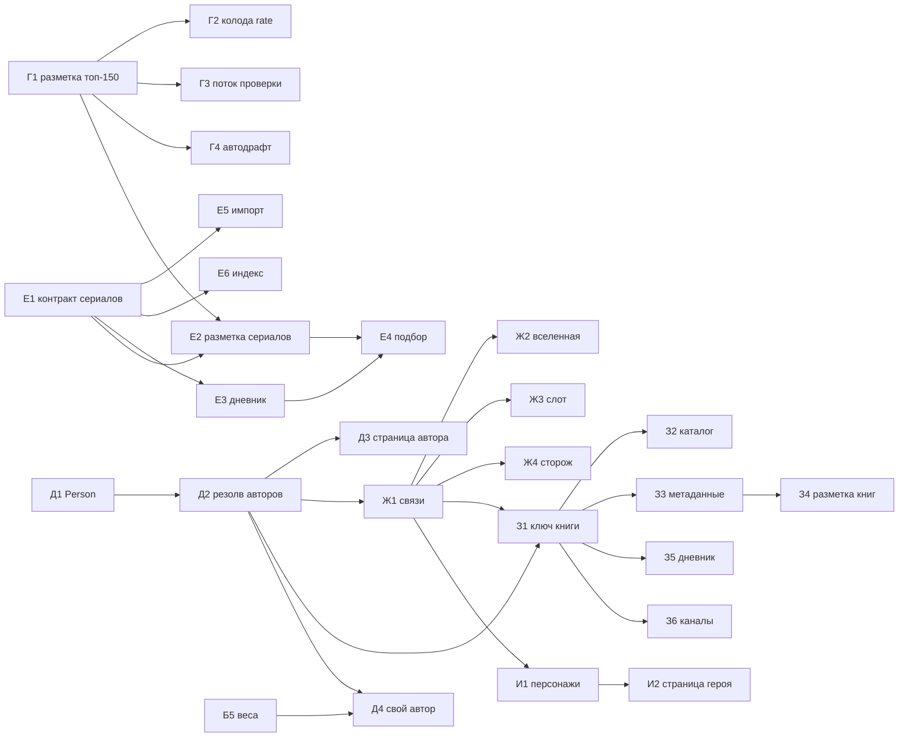

# Бэклог — Transformative Media

Обновлено 30.09.2026 (утро). Очередь с приоритетами и статусами. Замысел и объяснения — в
`ROADMAP.md` (§8), состояние кода — в `HANDOFF.md`. Берём задачи сверху вниз; закрытая строка
получает дату и уходит в «Сделано».

Размеры: S — до дня, M — несколько дней, L — неделя и больше.

## Очередь

### P0 — эксплуатация: сборщик и хвосты 29.09

| # | ID | Задача | Размер | Статус | Готово, когда |
|---|---|---|---|---|---|
| 1 | OPS-5 | Прокликать значки авторов и строку поиска после правки ссылок | S | нужен владелец или превью в браузере | проверено руками |
| — | OPS-7 | Ярус 224 каналов из ссылок (`src/mocks/sources.ts`) | — | владелец, по мере разбора | — |

### Треки ROADMAP §8

Г идёт всё время. Д и Е независимы и идут параллельно. Ж опирается на идентификаторы Wikidata
из Д. З требует Д и Ж. И — только после Ж.

| # | ID | Задача | Размер | Зависит от |
|---|---|---|---|---|
| 22 | З3 | Метаданные и обложки: Wikidata, Open Library | M | З1 |
| 23 | З4 | Разметка книг: калибровка 20–30 вручную | L | З3 |
| 24 | З5 | Дневник чтения по частям, честное «где читать» | M | З1 |
| 25 | З6 | Книжные каналы (9) обходятся под книги | S | З1 |
| 26 | И1 | Персонажи через два и больше произведений (P674, P1441) | M | Ж1 |
| 27 | И2 | Страница героя | S | И1 |

### Ждут условий

| ID | Задача | Условие |
|---|---|---|
| Б5 | Подгонка `SCORE_WEIGHTS` и `DIFFICULTY_SPREAD`, сравнение с базовыми стратегиями | 30+ наблюдений в петле |
| Д4 | Сигнал «свой автор» в подборе | Б5 и Д2 |
| В-список | Каналы подборок «что посмотреть» (`lists: true` в `sources.ts`: Слава Киноман, Kino Time, Киносоветник): разобрать фильмы из описаний роликов (таймкоды с названиями) → сигнал «советуют смотреть» для списка первых профилей (`profile-deck.mts`) и подбора | первый обход этих каналов — посмотреть, как устроены описания |
| М1 | Монетизация: партнёрские ссылки (CPA/CPS — Литрес, Иви через Admitad, Okko через Pampadu; условия проверить при подключении) только в «где смотреть / купить», никогда в порядке подбора; «прочитать роман» после экранизации (связи Ж1); нишевым сервисам и издательствам — совместные полки и траектории с пометкой партнёра | месяц цифр: переходы в кинотеатры, старты по переходу, досмотры (обсуждение 30.09) |

## Зависимости

## Сделано

| Дата | ID | Что |
|---|---|---|
| 30.09 | OPS-1 | `tools/youtube.mts`: сетевой сбой — повтор через 5 с, дальше работа без данных YouTube; см. HANDOFF «Сборщик не падает от сбоя YouTube» |
| 30.09 | OPS-2 | Прогон 30.09 прошёл целиком и опубликован: мимо индекса 293 → 0, сборников отсеяно 120 (ждали ~117), «не проверено» 58,8% → 56,5%, предупреждений нет. YouTube отвечал — запасной путь OPS-1 в бою не понадобился |
| 30.09 | OPS-3 | Коммиты `3362735` (хвост 29.09), `5b0fd29` (OPS-1, бэклог), `7f26813` (индексы 30.09). Push — с Mac: из песочницы нет SSH-ключа |
| 30.09 | OPS-4 | Сторожа тёзок: номер, латинское продолжение, капс в капсе, «Я — легенда», чужой режиссёр; −27 привязок и −24 ложных улики на замере; см. HANDOFF «Сторожа тёзок» |
| 30.09 | OPS-8 | Кэш ответов YouTube (`.cache/youtube/meta.json`) и дамп — запасной источник для `build-telegram-index`; `build-essay-index` без сети выходит, сохраняя прежний индекс; см. HANDOFF «Запасные данные о роликах» |
| 30.09 | OPS-9 | Выбор тёзки (`pickNamesake`): поздние отпадают, улика, «сериал» в тексте; «раньше фильма» (`tooEarly`) снимает привязку; на замере 28 переездов — все верные, 51 одиночка снят; см. HANDOFF «Тёзки» |
| 30.09 | OPS-10 | Сторож режиссёра: капс без кавычек и создатели латиницей (сравнение по звучанию); +2 верных противоречия, ложных нет |
| 30.09 | — | Таблица film_reviews подхватывает 224 канала из ссылок (просьба владельца); см. HANDOFF |
| 30.09 | HYG-1 | README — карта документов, устройство, запуск |
| 30.09 | HYG-2 | Удалены 30 профилей Chrome из корня и тестовый файл |
| 30.09 | — | Список первых оценок: канон массового зрителя (174 фильма, `massCanon.ts`), сигнал «канон», топ-300; 80 карточек ждут `add-shelf-films` на Mac |
| 30.09 | — | Таблица film_reviews: догадки для каналов из ссылок (`match-videos.mts`), в таблице только ролики с догадкой или решением — 12 301 строка вместо 67 895 |
| 30.09 | Г1 | Черновая разметка: +267 фильмов (весь список первых оценок размечен), `needs_review`; см. HANDOFF «Г1: второй круг» |
| 30.09 | Г3 | Кураторская: очередь из настоящих черновиков, «Сегодня» по 20, колода первой, переход к следующему после решения, решения → `apply-review.mts` → `draftReview.ts`; см. HANDOFF «Г3» |
| 30.09 | Г2 | Колода `/rate` пересобрана из списка (51 фильм, у всех обложка и регистр — `build-base-media` на Mac, 150 карточек) |
| 30.09 | — | Черновики в подборе (471 без неуверенных); кураторская сортирует по сигналам петли (`byWork`: промах трудности, бросок, «не сейчас»). Нужна выкладка приложения и сервера |
| 30.09 | Г4 | `draft-annotate.mts`: список фильмов без черновика; `--run` — разметка через Anthropic API (нужен `ANTHROPIC_API_KEY`) |
| 30.09 | OPS-6 | Вопрос о норме шкалы над лентой для присланных историй (≥10 оценок, нормы нет) |
| 30.09 | HYG-3 | `build-essay-index` на `bestByTitle` из `match-videos.mts`: результат тот же, в 20 раз быстрее |
| 30.09 | Е1 | Сериал — свой вид: `MediaType` += `'series'`, `series?: SeriesInfo` (сезоны, серии, минут в серии, идёт/закончен, антология), `format` устарел и приводится `normalizeWork` при загрузке; проверки через `src/lib/media.ts`; 62 карточки перенесены; см. HANDOFF «Сериал — свой вид» |
| 30.09 | Д1 | Контракт авторов: `Person` (ключ — элемент Wikidata), `Credit {personId, role, name}`, роли director/writer/creator/author, `WorkCard.credits`; `src/lib/credits.ts` (`creditsOf`, `leadCredits`, `defaultRole`, `peopleIn`), пустой справочник `src/mocks/people.ts`; резолвер Wikidata пишет режиссёров в `credits`; см. HANDOFF «Авторы: контракт» |
| 30.09 | Е5 | Импорт: сериалы сопоставляются и резолвятся, а не откладываются; выгрузка IMDb отдаёт сериалы (tvSeries/tvMiniSeries, без отдельных серий); TMDb сверяется только внутри вида; шторка без «откладываем»; см. HANDOFF «Сериалы в импорте» |
| 30.09 | Д2 | Резолв авторов: `tools/resolve-credits.mts` (Wikidata P57/P58/P170/P50, TMDb `created_by` → P4985) пишет `people.ts` и `workCredits.ts`, приложение подкладывает `credits` карточкам; рантайм-резолвер берёт и сценаристов. **Прогон — владелец на Маке** (`deploy/resolve-credits.command`): из VM сети до Wikidata нет; см. HANDOFF «Авторы: резолв» |
| 30.09 | Е2 | Черновая разметка 121 сериала (`src/mocks/seriesAnnotations.ts`, ключ `imdb:`): 6 антологий по сезонам (27 сезонов), поправки сезонов у «Ганнибала» и «Шерлока»; high 77 / medium 34 / low 10. В кураторской — сериал или сезон антологии; на странице произведения — уровень и операции; в подбор не идут (Е4). Карточки сериалов из профилей — `seriesBase.ts`; см. HANDOFF «Разметка сериалов» |
| 30.09 | Е6 | Разборы сериалов: `season`/`episode` у материала (`tools/series-part.mts`: «3 сезон», «S05E14», «третий сезон», диапазоны — пусто), подпись «3 сезон, 4 серия» в карточке; 66 сериалов из профилей ищутся в роликах и постах (однословные и «чужие» названия — только в разговоре о сериале). На дампе: +173 привязки, 22 переезда, 0 потерь; см. HANDOFF «Разборы сериалов» |
| 30.09 | Д3 | Страница автора-создателя `/person/:id` (`PersonScreen`, `getPerson`): работы с уровнем и регистрами, «с чего начать» (непросмотренное чуть выше привычного), разборы эссеистов о его работах, траектории; в карточке произведения — ссылки «Режиссёр: …». Адрес — элемент Wikidata, до Д2 — имя (`n-…`); см. HANDOFF «Страница автора» |
| 30.09 | Е3 | Дневник сериала: «где вы сейчас» (сезон, серия), чек-ин после сезона (`season_finished` — запись остаётся «смотрю»), «досмотрел весь сериал», «остановились на 2 сезоне: причина»; колонка `journal.series` (миграция), `POST /api/journal/:id/progress`. Сервер проверен на sql.js; см. HANDOFF «Дневник сериала» |
| 30.09 | Е4 | Сериалы в подборе: черновики сериалов (не low) — кандидаты, у антологии — сезон; общее время — штраф в оценке (`timePenalty`, без сил вдвое) и первый барьер «Около N часов»; новичку в сериалах — только мини-сериалы и сезоны антологий; в слейте не больше одного сериала; оценки и досмотренные сериалы идут в модель. В `/rate` — ряд «Сериалы»; см. HANDOFF «Сериалы в подборе» |
| 30.09 | Ж1 | Связи между произведениями: `tools/resolve-relations.mts` (Wikidata P144, P155/P156, P179, P8345) → `src/mocks/workRelations.ts` (узлы и рёбра `adaptation_of`/`sequel_of`/`remake_of`/`part_of`); на странице произведения — раздел «Откуда и что дальше». Поиск элементов Wikidata вынесен в `tools/wikidata-lib.mts` (общий с Д2). **Прогон — владелец на Маке** (`deploy/resolve-relations.command`); см. HANDOFF «Связи между произведениями» |
| 30.09 | Ж2 | Страница вселенной `/universe/:id` (`UniverseScreen`, `getUniverse`): связные куски графа Ж1, средоточие — франшиза, цикл или самый связанный узел; состав по видам в порядке выхода, «по сюжету» — цепочки продолжений, «с чего начать», места разговора; из карточки — ссылка «Вселенная …» (от трёх произведений). Данных нет до прогона Ж1; см. HANDOFF «Страница вселенной» |
| 30.09 | Ж3 | Слот «Дальше во вселенной» (`universePick`, слот `universe`) — сверх слотов развития: сиквел последнего досмотренного, иначе лучшее непросмотренное той же вселенной; модель только отсекает совсем не по силам. Плюс 39 заложенных вселенных (`tools/universe-seeds.mts` → `tools/seed-universes.mts`): франшиза в Wikidata, состав целиком, вики фандома и открытые API (проверяются пингом) → «Энциклопедии и данные» на странице вселенной; недостающие фильмы — `.cache/universe-missing.tsv`; см. HANDOFF «Дальше во вселенной» |
| 30.09 | Ж4 | Сторож экранизаций на связях Ж1 (`tools/adaptation-guard.mts`): разбор фильма по книге переезжает к экранизации (год, режиссёр, сериал, своя карточка), о книге и сравнения остаются книге; без связей — прежнее правило, результат на дампе совпал до ролика. На поддельном графе: 8 роликов «Мастера и Маргариты» переехали к фильму 2024-го вместо того, чтобы пропасть; см. HANDOFF «Сторож экранизаций» |
| 30.09 | З1 | Ключ книги — произведение: `wd:<Q>` / `olw:<OL…W>`, без моста — по-старому `isbn:` (`src/lib/keys.ts`: `workKeys`, `primaryKey`, `isBookKey`, `withBookWork`). Мост ISBN → работа Open Library → Wikidata — `tools/resolve-book-works.mts` → `src/mocks/bookWorks.ts` (склейку двух книг в одно произведение не пишет). Приложение ищет по всем ключам книги, старые данные не теряются; импорт берёт работу Open Library сразу. `deploy/resolve-all.command` — всё из Wikidata по порядку; см. HANDOFF «Книга — произведение» |
| 30.09 | З2 | Стартовый каталог книг через мост с кино: `tools/build-book-base.mts` → `src/mocks/bookBase.ts` — книги по экранизациям справочника (связи Ж1, чем больше наших экранизаций, тем выше, до 300) и книги, названные кино-эссеистами рядом с книжным словом (`tools/book-bridge.mts`; в двух каналах или с автором, подтверждённым Open Library). Кандидаты — `.cache/book-candidates.tsv`. В приложении — поиск, страницы, ссылки «Экранизация книги»; в подбор до З4 не идут. Шаг 5 в `deploy/resolve-all.command`; см. HANDOFF «Книги через мост с кино» |
