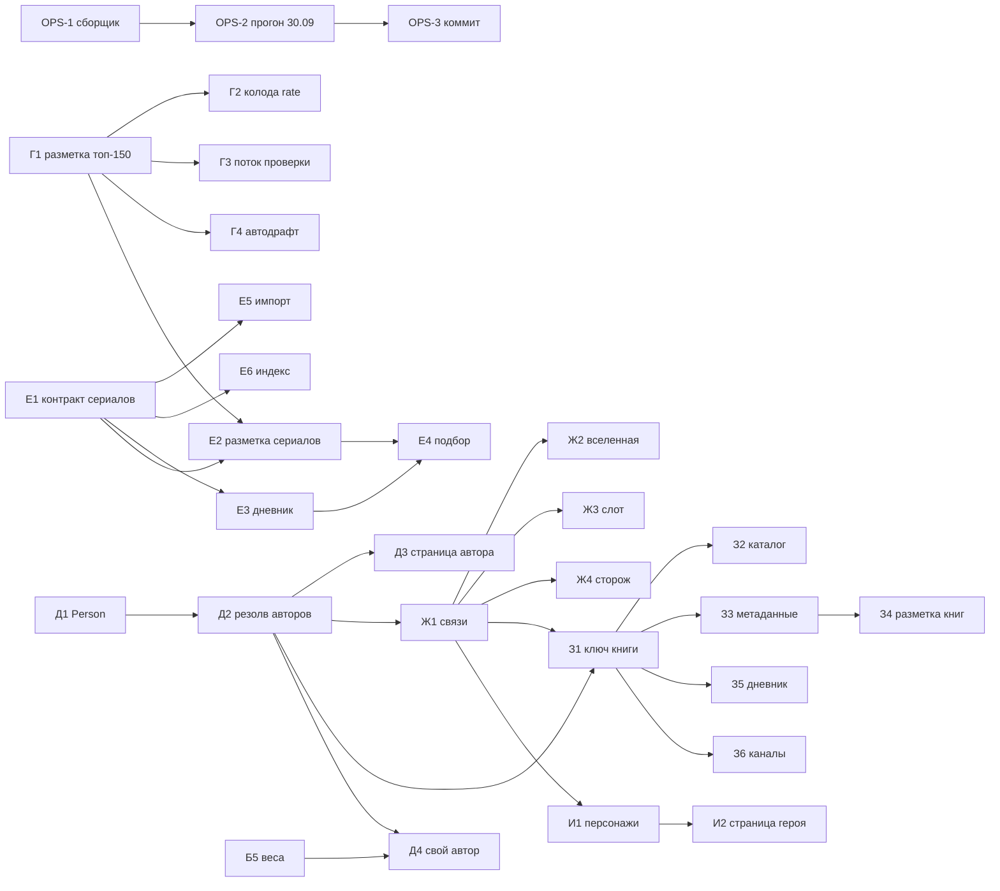

# Бэклог — Transformative Media

Обновлено 30.09.2026. Очередь с приоритетами и статусами. Замысел и объяснения — в
`ROADMAP.md` (§8), состояние кода — в `HANDOFF.md`. Берём задачи сверху вниз; закрытая строка
получает дату и уходит в «Сделано».

Размеры: S — до дня, M — несколько дней, L — неделя и больше.

## Очередь

### P0 — эксплуатация: сборщик и хвосты 29.09

| # | ID | Задача | Размер | Статус | Готово, когда |
|---|---|---|---|---|---|
| 1 | OPS-1 | Сборщик не падает от сетевого сбоя YouTube (`tools/youtube.mts`: повтор, `youtubeNet.down`) | S | сделано 30.09, ждёт боевой проверки | прогон 30.09 прошёл шаг «разборы в постах» |
| 2 | OPS-2 | Разбор ночного прогона 30.09: первое сравнение контрольных замеров; сколько снял отсев сборников (ждём ~117); «мимо индекса» 293 → единицы | S | ждёт прогона 06:30 | числа сошлись или заведена задача на починку |
| 3 | OPS-3 | Коммит хвоста 29.09 и OPS-1 (17 изменённых, 6 новых файлов) | S | после OPS-2 — прогон проверяет этот код | рабочее дерево чистое, `origin/main` догнан |
| 4 | OPS-4 | Тёзки у обзорщиков: сторож сопоставления («Легенда», 1985 — четыре чужих обзора) | S | — | тёзки из отчёта не привязываются |
| 5 | OPS-8 | Метаданные роликов из дампа `.cache/youtube/videos.json`, когда YouTube недоступен; сетевой сбой в `build-essay-index` без падения | S | — | прогон без сети даёт те же названия и длительности для роликов из дампа |
| 6 | OPS-6 | Норма шкалы присланных профилей (у одного медиана 10) — вопрос участнику при входе | S | — | оценки приводятся к шкале участника |
| 7 | OPS-5 | Прокликать значки авторов и строку поиска после правки ссылок | S | нужен владелец или превью в браузере | проверено руками |
| 8 | HYG-1 | `README.md` — текущее состояние (сейчас там «кода нет») | S | — | README ведёт на ROADMAP, HANDOFF, BACKLOG и запуск |
| 9 | HYG-2 | Убрать из корня 30 профилей Chrome (`prof-cdp-*`, `prof-shot2-*`, ~25 тыс. файлов) и `.cache/_yt-test.mts` | S | нужно разрешение на удаление | корень чистый |
| — | OPS-7 | Ярус 224 каналов из ссылок (`src/mocks/sources.ts`) | — | владелец, по мере разбора | — |

### Треки ROADMAP §8

Г идёт всё время. Д и Е независимы и идут параллельно. Ж опирается на идентификаторы Wikidata
из Д. З требует Д и Ж. И — только после Ж.

| # | ID | Задача | Размер | Зависит от |
|---|---|---|---|---|
| 10 | Г1 | Черновая разметка 117 неразмеченных из топ-150 смотримого (`needs_review`) | M | — |
| 11 | Г2 | Колода `/rate` из списка: только размеченные, смотримые сверху, разброс уровня и регистров (правило — в `profile-deck.mts`) | S | Г1 |
| 12 | Г3 | Поток проверки черновиков в кураторской: 20 в день, сначала колода | M | Г1 |
| 13 | Г4 | Новые фильмы в топе сами уходят в черновик | S | Г1 |
| 14 | Д1 | Контракт `Person` и `credits` (director, writer, creator, author) | M | — |
| 15 | Е1 | Контракт: `MediaType` += `series`, ключ `imdb:`, сезоны и серии | M | — |
| 16 | Е5 | Импорт: сериалы из выгрузок перестают откладываться | S | Е1 |
| 17 | Д2 | Резолв авторов: Wikidata P57, P58, P170, P50; TMDb `created_by` | M | Д1 |
| 18 | Е2 | Разметка сериалов: единица — сериал, у антологии — сезон; черновик 115 сериалов | M | Е1, Г1 |
| 19 | Е6 | Индекс разборов: ролики о сезоне и серии → сериал | S | Е1 |
| 20 | Д3 | Страница `/person/:id` | M | Д2 |
| 21 | Е3 | Дневник: сезон и серия, «бросил» с причиной, чек-ин по сезонам | M | Е1 |
| 22 | Е4 | Подбор: сериалы в пуле, время — первый барьер, ряд в `/rate` | M | Е2, Е3 |
| 23 | Ж1 | Связи: экранизация, сиквел, ремейк, часть серии (P144, P155/P156, P179, P8345) | M | Д2 |
| 24 | Ж2 | Страница вселенной `/universe/:id` | M | Ж1 |
| 25 | Ж3 | Слот «дальше во вселенной» в подборе | S | Ж1 |
| 26 | Ж4 | Сторож «разбор экранизации не про книгу» — по связи Ж1 | S | Ж1 |
| 27 | З1 | Ключ книги — Wikidata / работа Open Library, не ISBN | M | Д2, Ж1 |
| 28 | З2 | Стартовый каталог книг через мост с кино | M | З1 |
| 29 | З3 | Метаданные и обложки: Wikidata, Open Library | M | З1 |
| 30 | З4 | Разметка книг: калибровка 20–30 вручную | L | З3 |
| 31 | З5 | Дневник чтения по частям, честное «где читать» | M | З1 |
| 32 | З6 | Книжные каналы (9) обходятся под книги | S | З1 |
| 33 | И1 | Персонажи через два и больше произведений (P674, P1441) | M | Ж1 |
| 34 | И2 | Страница героя | S | И1 |

### Ждут условий

| ID | Задача | Условие |
|---|---|---|
| Б5 | Подгонка `SCORE_WEIGHTS` и `DIFFICULTY_SPREAD`, сравнение с базовыми стратегиями | 30+ наблюдений в петле |
| Д4 | Сигнал «свой автор» в подборе | Б5 и Д2 |

## Зависимости

## Сделано

| Дата | ID | Что |
|---|---|---|
| 30.09 | OPS-1 | `tools/youtube.mts`: сетевой сбой — повтор через 5 с, дальше работа без данных YouTube; см. HANDOFF «Сборщик не падает от сбоя YouTube» |
