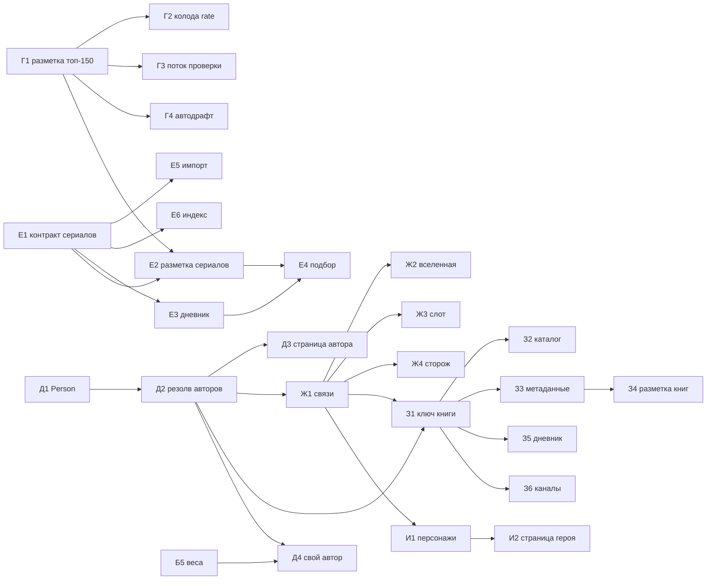

# Бэклог — Transformative Media

Обновлено 30.09.2026 (утро). Очередь с приоритетами и статусами. Замысел и объяснения — в
`ROADMAP.md` (§8), состояние кода — в `HANDOFF.md`. Берём задачи сверху вниз; закрытая строка
получает дату и уходит в «Сделано».

Размеры: S — до дня, M — несколько дней, L — неделя и больше.

## Очередь

### P0 — эксплуатация: сборщик и хвосты 29.09

| # | ID | Задача | Размер | Статус | Готово, когда |
|---|---|---|---|---|---|
| 1 | OPS-6 | Норма шкалы присланных профилей (у одного медиана 10) — вопрос участнику при входе | S | — | оценки приводятся к шкале участника |
| 2 | OPS-5 | Прокликать значки авторов и строку поиска после правки ссылок | S | нужен владелец или превью в браузере | проверено руками |
| 3 | HYG-3 | `build-essay-index` — на общий `tools/match-videos.mts` (правила сопоставления сейчас в двух местах) | S | — | один источник правил, замер индекса без изменений |
| — | OPS-7 | Ярус 224 каналов из ссылок (`src/mocks/sources.ts`) | — | владелец, по мере разбора | — |

### Треки ROADMAP §8

Г идёт всё время. Д и Е независимы и идут параллельно. Ж опирается на идентификаторы Wikidata
из Д. З требует Д и Ж. И — только после Ж.

| # | ID | Задача | Размер | Зависит от |
|---|---|---|---|---|
| 3 | Г1 | Черновая разметка неразмеченных из топ-смотримого (`needs_review`); с каноном (30.09) топ — 300, неразмеченных в нём 147 | M | карточки канона (add-shelf-films на Mac) |
| 4 | Г2 | Колода `/rate` из списка: только размеченные, смотримые сверху, разброс уровня и регистров (правило — в `profile-deck.mts`) | S | Г1 |
| 5 | Г3 | Поток проверки черновиков в кураторской: 20 в день, сначала колода | M | Г1 |
| 6 | Г4 | Новые фильмы в топе сами уходят в черновик | S | Г1 |
| 7 | Д1 | Контракт `Person` и `credits` (director, writer, creator, author) | M | — |
| 8 | Е1 | Контракт: `MediaType` += `series`, ключ `imdb:`, сезоны и серии | M | — |
| 9 | Е5 | Импорт: сериалы из выгрузок перестают откладываться | S | Е1 |
| 10 | Д2 | Резолв авторов: Wikidata P57, P58, P170, P50; TMDb `created_by` | M | Д1 |
| 11 | Е2 | Разметка сериалов: единица — сериал, у антологии — сезон; черновик 115 сериалов | M | Е1, Г1 |
| 12 | Е6 | Индекс разборов: ролики о сезоне и серии → сериал | S | Е1 |
| 13 | Д3 | Страница `/person/:id` | M | Д2 |
| 14 | Е3 | Дневник: сезон и серия, «бросил» с причиной, чек-ин по сезонам | M | Е1 |
| 15 | Е4 | Подбор: сериалы в пуле, время — первый барьер, ряд в `/rate` | M | Е2, Е3 |
| 16 | Ж1 | Связи: экранизация, сиквел, ремейк, часть серии (P144, P155/P156, P179, P8345) | M | Д2 |
| 17 | Ж2 | Страница вселенной `/universe/:id` | M | Ж1 |
| 18 | Ж3 | Слот «дальше во вселенной» в подборе | S | Ж1 |
| 19 | Ж4 | Сторож «разбор экранизации не про книгу» — по связи Ж1 | S | Ж1 |
| 20 | З1 | Ключ книги — Wikidata / работа Open Library, не ISBN | M | Д2, Ж1 |
| 21 | З2 | Стартовый каталог книг через мост с кино | M | З1 |
| 22 | З3 | Метаданные и обложки: Wikidata, Open Library | M | З1 |
| 23 | З4 | Разметка книг: калибровка 20–30 вручную | L | З3 |
| 24 | З5 | Дневник чтения по частям, честное «где читать» | M | З1 |
| 25 | З6 | Книжные каналы (9) обходятся под книги | S | З1 |
| 26 | И1 | Персонажи через два и больше произведений (P674, P1441) | M | Ж1 |
| 27 | И2 | Страница героя | S | И1 |

### Ждут условий

| ID | Задача | Условие |
|---|---|---|
| Б5 | Подгонка `SCORE_WEIGHTS` и `DIFFICULTY_SPREAD`, сравнение с базовыми стратегиями | 30+ наблюдений в петле |
| Д4 | Сигнал «свой автор» в подборе | Б5 и Д2 |

## Зависимости

## Сделано

| Дата | ID | Что |
|---|---|---|
| 30.09 | OPS-1 | `tools/youtube.mts`: сетевой сбой — повтор через 5 с, дальше работа без данных YouTube; см. HANDOFF «Сборщик не падает от сбоя YouTube» |
| 30.09 | OPS-2 | Прогон 30.09 прошёл целиком и опубликован: мимо индекса 293 → 0, сборников отсеяно 120 (ждали ~117), «не проверено» 58,8% → 56,5%, предупреждений нет. YouTube отвечал — запасной путь OPS-1 в бою не понадобился |
| 30.09 | OPS-3 | Коммиты `3362735` (хвост 29.09), `5b0fd29` (OPS-1, бэклог), `7f26813` (индексы 30.09). Push — с Mac: из песочницы нет SSH-ключа |
| 30.09 | OPS-4 | Сторожа тёзок: номер, латинское продолжение, капс в капсе, «Я — легенда», чужой режиссёр; −27 привязок и −24 ложных улики на замере; см. HANDOFF «Сторожа тёзок» |
| 30.09 | OPS-8 | Кэш ответов YouTube (`.cache/youtube/meta.json`) и дамп — запасной источник для `build-telegram-index`; `build-essay-index` без сети выходит, сохраняя прежний индекс; см. HANDOFF «Запасные данные о роликах» |
| 30.09 | OPS-9 | Выбор тёзки (`pickNamesake`): поздние отпадают, улика, «сериал» в тексте; «раньше фильма» (`tooEarly`) снимает привязку; на замере 28 переездов — все верные, 51 одиночка снят; см. HANDOFF «Тёзки» |
| 30.09 | OPS-10 | Сторож режиссёра: капс без кавычек и создатели латиницей (сравнение по звучанию); +2 верных противоречия, ложных нет |
| 30.09 | — | Таблица film_reviews подхватывает 224 канала из ссылок (просьба владельца); см. HANDOFF |
| 30.09 | HYG-1 | README — карта документов, устройство, запуск |
| 30.09 | HYG-2 | Удалены 30 профилей Chrome из корня и тестовый файл |
| 30.09 | — | Список первых оценок: канон массового зрителя (174 фильма, `massCanon.ts`), сигнал «канон», топ-300; 80 карточек ждут `add-shelf-films` на Mac |
| 30.09 | — | Таблица film_reviews: догадки для каналов из ссылок (`match-videos.mts`), в таблице только ролики с догадкой или решением — 12 301 строка вместо 67 895 |
