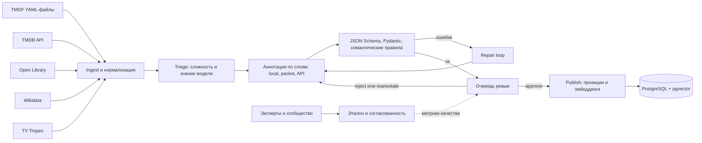
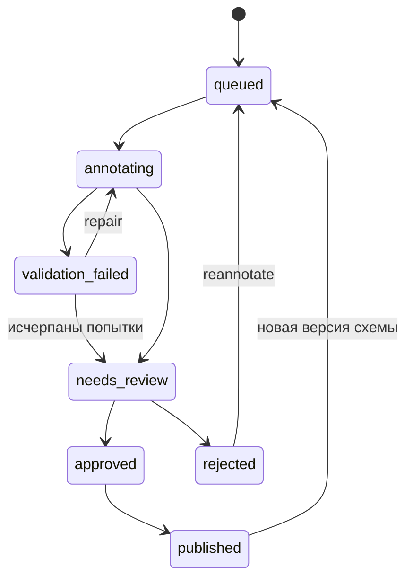
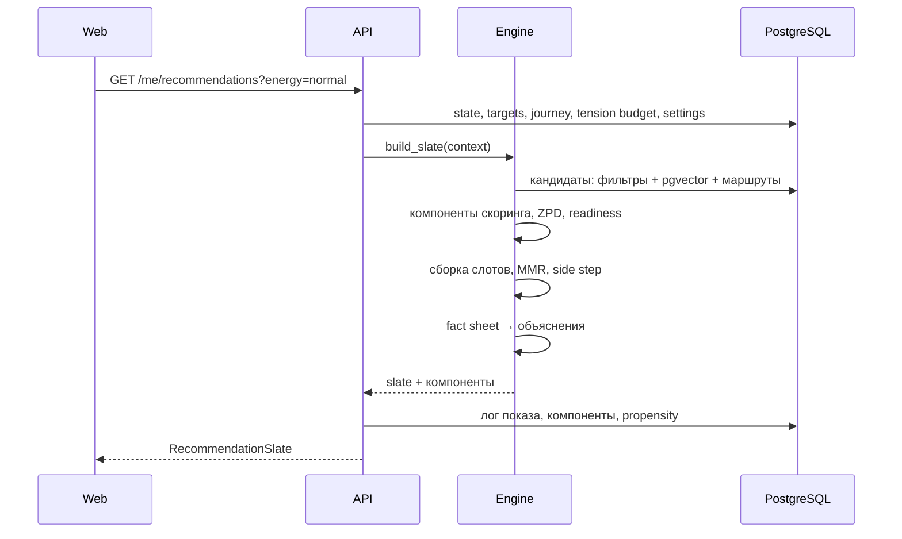
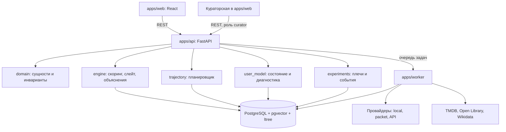
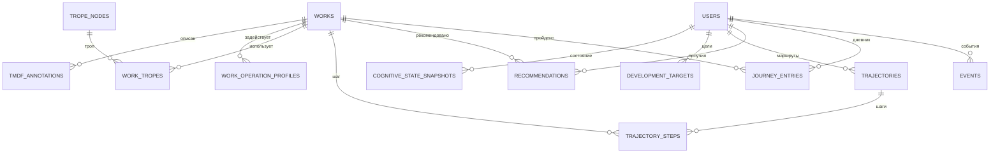

# Промпт для Claude Code — разработка платформы Transformative Media

> Версия 0.4 — зафиксированные решения владельца продукта (§0.1) и экспертный контур (§7.7). Данные создаются с нуля.

> Вставь этот текст в первую сессию Claude Code в пустом репозитории. Промпт самодостаточен. Если есть концепт-документ, положи его в `docs/concept.md` как первоисточник идей.
> Фронтенд придёт отдельно — handoff-бандлом из Claude Design (см. §13.5). Контракт данных в §11 идентичен контракту в промпте для Claude Design.

---

## 0. Роль и режим работы

Ты — ведущий инженер и архитектор проекта Transformative Media. Я — Дмитрий, владелец продукта.

Правила работы:

1. **Сначала план, потом код.** Прочитай промпт (и `docs/concept.md`, если есть). Выдай: (а) план фаз 0–2 из §15, (б) до 10 вопросов, блокирующих решения, (в) список допущений, которые примешь, если я не отвечу. Жди ответа.
2. **Работай фазами.** В конце фазы — отчёт: что сделано, где отклонился от промпта и почему, какие тесты добавлены, что дальше. Перед следующей фазой жди подтверждения.
3. **Никаких молчаливых отклонений.** Архитектурное решение, отличающееся от промпта, фиксируй ADR в `docs/adr/NNNN-название.md` (контекст, решение, альтернативы, последствия).
4. **`CLAUDE.md` в корне** — создай и поддерживай: стек, команды, структура, инварианты из §3, глоссарий из §2, текущая фаза, известные долги.
5. **Эвристики — подменяемые стратегии.** Формулы скоринга, обновления модели пользователя, построения маршрутов реализуй как стратегии с конфигом и версией (`strategy_id`, `version`, параметры в YAML/БД). Хардкод коэффициентов запрещён.
6. **TMDF проектируется вместе со мной.** Прежняя схема утрачена. Не добивай число полей до «89+» ради числа — проектируй по процессу §5.2, каждое поле должно иметь потребителя. До моего утверждения схема имеет статус `draft`.
7. **Тесты обязательны.** Скоринговые функции — property-based тесты (hypothesis). Пайплайн аннотации — тесты на фикстурах без реальных вызовов API. Ключевой пользовательский сценарий — e2e.
8. **Коммиты** небольшие, conventional commits. Миграции только через Alembic.
9. **Язык.** Код, идентификаторы, комментарии в коде — английский. Документация в `docs/` и отчёты мне — русский.

### 0.1 Зафиксированные решения

| # | Вопрос | Решение | Где отражено |
|---|---|---|---|
| 1 | Прежняя TMDF-схема | Утрачена. TMDF v1 проектируется заново по процессу §5.2 | §5 |
| 2 | Формат TMDF | YAML для схемы и документов; JSON — обмен с моделями и API; JSONB — в БД | §5.1 |
| 3 | Шкала | 0..10 для demand произведений и способностей пользователя | §6, §8 |
| 4 | Вход | Magic link | §12, §13.1 |
| 5 | Язык интерфейса | ru — основной, en — второй | §13.1 |
| 6 | Эмбеддинги | Локальная модель | §7.4 |
| 7 | Хостинг | Локально, одна машина. Юрисдикция не определена → строгий режим приватности по умолчанию | §13.1, §14 |
| 8 | Пороги качества разметки | Относительно согласованности людей между собой (пока разметчиков мало — человека с самим собой) + абсолютный минимум; ждут подтверждения | §7.5 |
| 9 | A/B-плечо | С первого пользователя | §10.3 |
| 10 | Бюджет на платные LLM | Нулевой. Платные API выключены; локальная модель и пакетный режим | §7.3, §7.6 |
| 11 | Внешняя экспертиза | Кинокритики и авторы видеоразборов, сообщества киноманов, TV Tropes — источники эталона с разными ролями | §7.7 |
| 12 | Старые аннотации | Не сохранились. Все данные создаются с нуля: пилот §5.2 → эталон §7.5 → пайплайн | §5.2, §7.5 |

---

## 1. Продукт

Transformative Media — рекомендательная платформа для фильмов и книг, которая оптимизирует не вероятность того, что произведение понравится, а **полезность произведения для развития способов мышления конкретного человека прямо сейчас**.

Обычная система: `User → Item` по сходству и вовлечённости.
Эта система: `Current Cognitive State → Development Target → Media → Transformation → New Cognitive State`.

Три сущности-вопроса:

- **Media** — что произведение делает с мышлением?
- **User** — как человек сейчас способен его воспринять?
- **Trajectory** — какое следующее произведение даст самый полезный шаг?

Формула ядра: `Media Structure × Cognitive Operations × User State → Transformative Recommendation`.

Продукт на поверхности: рекомендации с объяснениями, карта мышления, маршруты, дневник пройденного. Вся аналитика TMDF — инфраструктура, пользователь её не видит (**Hide the complexity, surface the magic**).

---

## 2. Глоссарий

| Термин | Значение |
|---|---|
| **TMDF** | Transformative Media Description Format — структурированное описание произведения (89+ параметров, несколько слоёв). |
| **Cognitive Operation** | Одна из 8 операций мышления (§6). |
| **Demand** (операции) | Уровень способности 0..10, нужный, чтобы произведение «заработало» по этой операции. |
| **Activation** (операции) | Сила стимула 0..1: насколько произведение тренирует операцию. Demand и activation — разные величины. |
| **Trope Usage Type** | straight / deconstruction / subversion / reconstruction / meta. |
| **Transformative Potential** | Внутреннее свойство произведения, не зависит от пользователя. |
| **User-Specific Fit** | Полезность произведения для конкретного пользователя сейчас. Никогда не хранится на произведении. |
| **ZPD** | Zone of Proximal Development: оптимальный разрыв demand − ability ≈ +1…+2. |
| **Development Target** | 1–2 операции, на развитие которых сейчас направлен маршрут. |
| **Trajectory** | Упорядоченная последовательность произведений к цели. |
| **Peak path** | Маршрут подготовки к niche masterpiece. |
| **Slate** | Набор из 3–5 рекомендаций со слотами (next_step, stretch, side_step, preparation). |
| **Tension budget** | Сколько «напряжения» пользователь сейчас способен продуктивно выдержать. |
| **Refined estimate** | Изменение оценки из-за новых данных о пользователе. |
| **Observed growth** | Изменение способности, подтверждённое повторным измерением. |
| **Gold set / эталонный набор** | Произведения, размеченные человеком вслепую; мерило качества автоматической разметки. |
| **Silver standard** | Внешняя разметка без полной проверки (например, TV Tropes): годится для оценки полноты и подбора кандидатов, но не как истина. |
| **Pairwise comparison** | Задание «в каком из двух произведений операция требуется больше / задействуется сильнее»; из множества сравнений строится шкала. |
| **Packet mode** | Разметка без API: пайплайн выгружает задачи в файлы, внешний исполнитель возвращает результаты, пайплайн их валидирует. |

---

## 3. Инварианты (нарушать нельзя)

1. **Potential ≠ Fit.** Сложный шедевр с высоким потенциалом может иметь низкий fit для пользователя. Движок оптимизирует полезную сложность, а не абсолютную.
2. **Каждая рекомендация объяснима** по четырём вопросам: что / почему / зачем сейчас / что дальше. Объяснение строится только из фактов, которые реально есть в данных. Без фактов — нет объяснения — нет рекомендации.
3. **Collaborative filtering — вспомогательный сигнал**, не основной. До порога данных (конфиг) его вес = 0.
4. **Serendipity контролируема**: вне привычных кластеров, но внутри допустимого ZPD.
5. **Напряжение дозируется**: не больше одного `challenge` в слейте; два `challenge` подряд в маршруте запрещены без явного согласия пользователя.
6. **Уточнение оценки ≠ рост.** Обновления модели после активности помечаются `refined_estimate`. `observed_growth` появляется только по результатам повторных измерений (checkpoints / pre-post). Никакой код и никакой текст не выдаёт уточнение за развитие.
7. **LLM-аннотация — гипотеза.** Каждое поле хранит provenance и confidence. В рабочий движок попадают только `published` аннотации.
8. **Сложность скрыта на уровне API.** Пользовательские эндпоинты отдают проекции (`WorkCard`, `WorkDetail`), а не сырой TMDF. Числа — только при `showDetails = true`.
9. **Спойлеры контролируются сервером.** Любой контент с `spoiler_level` выше настройки пользователя не покидает API (исключение — «Разбор» после завершения произведения).
10. **Всё логируется для проверки гипотезы.** Каждая показанная рекомендация сохраняется с компонентами скоринга, версией стратегии и вероятностью попадания в слот (для serendipity — propensity).
11. **Никаких полных текстов.** Не храним и не отправляем в LLM полные тексты книг и сценариев. Только метаданные, синопсисы, собственные знания модели, пересказ.
12. **Честные формулировки.** Система не утверждает, что произведение «развивает X», пока это не подтверждено данными. В текстах — «может помочь», «задействует».
13. **Ручной труд живёт в git.** Схема, словари, таксономия, эталонная разметка, правки куратора, промпты и конфиги стратегий регулярно выгружаются в YAML-файлы репозитория. База данных — не единственное место, где хранится сделанное руками.
14. **Нулевой бюджет по умолчанию.** Любой платный вызов (Anthropic API и т. п.) заблокирован, пока в конфиге не задан ненулевой бюджет. Система полностью работает без платных API.

---

## 4. Скоуп

### MVP — входит

- База произведений (фильмы и книги) + TMDF-аннотации + трёхуровневая таксономия тропов.
- Эталонный набор с нуля: слепая разметка якорных произведений несколькими людьми.
- Экспертный контур: кабинет участника (эксперты и сообщество), парные сравнения, проверка тропов, голосование по барьерам, агрегирование и согласованность; TV Tropes как silver standard для тропов; ссылки на внешние разборы в карточке и «Разборе».
- Пайплайн аннотации до 100 произведений с валидацией, ревью и оценкой качества; дальнейшее масштабирование — по §7.6.
- Кураторская (внутренний интерфейс ревью и публикации).
- Диагностика: быстрая адаптивная (~8–10 мин) и полная (25–35 мин).
- Динамическая модель пользователя по 8 операциям с неопределённостью.
- Движок рекомендаций v1 со слотами, ZPD, readiness, serendipity, объяснениями.
- Маршруты развития и peak paths с перепланированием.
- Дневник, check-in после произведения, рефлексивные вопросы, «Разбор».
- Карта мышления (данные для визуализации).
- Инфраструктура экспериментов: event log, A/B с baseline, pre/post, checkpoints.
- Веб-фронтенд из handoff Claude Design.

### Не входит (не проектировать, но не закрывать дорогу)

- Obsidian и любые интеграции с базами заметок. Импорт идёт через общий порт `importers/` (§7.1), новый адаптер добавляется без изменений ядра.
- Другие типы медиа (статьи, игры, лекции, подкасты). `MediaType` расширяем, специфичные поля — в отдельных слоях TMDF.
- Нативные мобильные приложения, соцфункции, монетизация, ссылки на стриминги, публичный API.

---

## 5. TMDF — модель описания произведения

### 5.1 Принципы хранения

- **Полный TMDF-документ** хранится в `tmdf_annotations.document` (JSONB) и версионируется (`tmdf_version`, `annotation_version`).
- **Нормализованные проекции** (операции, тропы, пререквизиты, барьеры, сложность, эмбеддинги) строятся при публикации — движок читает только их.
- **Схема** — JSON Schema 2020-12, записанная в YAML: `packages/tmdf/schema/tmdf.schema.yaml`. Источник истины. Из неё генерируются Pydantic-модели и TS-типы для кураторской.
- **Документы TMDF** — YAML: `data/seed/works/<slug>.tmdf.yaml`, `data/gold/<slug>.tmdf.yaml`. Парсинг только YAML 1.2 safe-загрузчиком (ruamel.yaml), без неявных преобразований типов (`no`, `on`, `1e3`, даты); идентификаторы и коды — строки в кавычках. Сериализация детерминированная (порядок ключей по схеме), чтобы diff в git читался.
- **Модели возвращают JSON**, не YAML: структурированный вывод по схеме надёжнее. Конвертация JSON → YAML — на стороне пайплайна.
- Схема версионируется семантически; миграция документов между версиями — отдельные скрипты `packages/tmdf/migrations/`.

### 5.2 Проектирование TMDF v1

Прежняя схема утрачена, поэтому v1 проектируется заново:

1. **Потребители.** Для каждого слоя — кто читает поле: компонент скоринга, объяснения, «Разбор», кураторская, исследование. Поле без потребителя в v1 не попадает — уходит в `docs/tmdf/backlog.md`.
2. **Таблица полей** `docs/tmdf/fields.md`: путь, тип, диапазон или словарь, смысл, потребитель, кто заполняет (`llm | human | derived`), чувствительность к спойлерам, пример.
3. **Словари** (типы структуры, барьеры, темы, способы использования тропов) — YAML-файлы `packages/tmdf/vocab/` с определением каждого значения. Свободный текст — только там, где без него нельзя.
4. **Пилот на трёх контрастных произведениях**: «Двенадцать разгневанных мужчин» (простое), «Расёмон» (среднее), «Зеркало» (niche masterpiece). Я размечаю вручную, пайплайн — автоматически; сравниваем, где поля неоднозначны или бесполезны.
5. **Ревизия**: удалить, объединить, уточнить определения. Для каждой числовой шкалы — якорные примеры: что означает demand 2, 5 и 8.
6. **Заморозка v1.0**: changelog, миграции для следующих версий.

Скелет ниже — отправная точка для шага 1, не готовая схема.

### 5.3 Стартовый скелет v0.1

```yaml
tmdf_version: "0.1-draft"

work:
  id: uuid
  type: film | book
  titles: { ru: str, original: str, alt: [str] }
  year: int
  creators: [{ role: director | author | screenwriter | translator, name: str }]
  countries: [iso2]
  languages: [iso639]
  duration_minutes: int | null
  pages: int | null
  external_ids: { tmdb: str, imdb: str, isbn: [str], openlibrary: str, wikidata: str }
  synopsis_spoiler_free: str

narrative_structure:
  time_structure: linear | nonlinear | fragmented | cyclical | parallel | reverse
  narration:
    pov: first | third_limited | third_omniscient | multiple | second | unreliable
    reliability: 0..1
  framing_devices: [frame_story | story_within_story | epistolary | mockumentary | found_footage | ...]
  plot_architecture: three_act | episodic | mosaic | circular | anti_plot | ...
  resolution: closed | open | ambiguous | subverted
  information_density: 0..10

plot_mechanisms:
  - { mechanism: str, description: str, salience: 0..1, spoiler_level: 0..2 }

characters:
  significant_count: int
  items:
    - { id: str, archetype: str, arc: flat | positive | negative | transformational | testing,
        complexity: 0..10, is_pov: bool }
  relations:
    - { from: id, to: id, type: str, dynamics: str }

themes:
  - { theme: str, treatment: explored | asserted | questioned | subverted, salience: 0..1 }

tropes:
  - { trope_id: str, usage: straight | deconstruction | subversion | reconstruction | meta,
      salience: 0..1, spoiler_level: 0..2, evidence: str }   # evidence — пересказ, не цитата

cognitive_operations:            # ровно 8 ключей
  <operation>:
    demand: 0..10
    activation: 0..1
    mode: str                    # как именно задействуется
    evidence: [str]
    confidence: 0..1

complexity:
  narrative: 0..10
  temporal: 0..10
  ambiguity: 0..10
  symbolic: 0..10
  contextual_demand: 0..10       # нужный культурный/исторический контекст
  stylistic: 0..10               # язык, темп, форма
  overall: 0..10

transformative_potential:
  score: 0..1
  drivers: [str]
  rationale: str

audience_fit:
  breadth: 0..1                  # насколько широкой аудитории доступно
  recommended_media_literacy: 0..10
  niche_masterpiece: bool

prerequisites:
  - { kind: work | concept | context, ref: str, label: str, necessity: required | helpful }

barriers:
  - { kind: pacing | length | violence | era_distance | translation | cultural_context | formal_experiment,
      severity: 0..1, note: str }

content_warnings: [str]

provenance:
  annotator: model | human | hybrid
  model_id: str | null
  prompt_version: str
  run_id: uuid
  created_at: datetime
  reviewed_by: str | null
  field_confidence: { <json_path>: 0..1 }
  knowledge_sufficiency: sufficient | partial | insufficient
```

### 5.4 Таксономия тропов

- Иерархия: `Meta-Axis → Category → Subcategory → Atomic Trope`. Хранение — PostgreSQL `ltree`.
- Каждый атомарный троп: id, названия (ru/en), описание, типичные функции, связанные тропы.
- **Таблица отображения** `trope_usage_operation_map(trope_node, usage_type, operation, weight)`: базовые веса по умолчанию, наследование по дереву (вес подкатегории используется, если для атома нет своего), переопределение на уровне конкретного произведения.
- Модель: `Trope × Usage Type → Cognitive Operation → Potential Transformation`. Пример: троп «ненадёжный рассказчик» в режиме `straight` слабо задействует metacognition; в режиме `meta` — сильно задействует metacognition и critical_analysis.

### 5.5 Семантические правила валидации (сверх JSON Schema)

Реализуй как реестр правил с id, уровнем (error / warning) и сообщением. Минимум:

- ровно 8 операций; все значения в диапазонах;
- `complexity.overall` в пределах ±2 от среднего подшкал;
- `niche_masterpiece = true` требует `transformative_potential.score ≥ θ` и `audience_fit.breadth ≤ θ` (пороги в конфиге);
- `usage = meta | deconstruction` требует `salience ≥ θ` и непустого `evidence`;
- activation операции не противоречит сумме вкладов тропов больше, чем на δ (warning);
- `required`-пререквизит типа `work` ссылается на существующее произведение или помечен `unresolved`;
- `spoiler_level` задан для каждого plot_mechanism и tropes;
- при `knowledge_sufficiency = insufficient` статус не может быть выше `needs_review`.

---

## 6. Восемь когнитивных операций

| Ключ | Операция | Суть |
|---|---|---|
| `pattern_recognition` | Распознавание закономерностей | повторы, рифмы, скрытая структура |
| `causal_reasoning` | Причинно-следственное мышление | цепочки причин и следствий |
| `perspective_taking` | Смена перспективы | удержание нескольких точек зрения |
| `analogical_thinking` | Аналогическое мышление | перенос структуры между ситуациями |
| `synthesis` | Синтез | сборка разрозненного в целостную модель |
| `abstraction` | Абстракция | переход от частного к общей модели |
| `metacognition` | Метакогниция | наблюдение за собственным процессом интерпретации |
| `critical_analysis` | Критический анализ | проверка допущений, аргументов, интерпретаций |

Шкала способности пользователя и demand произведения — одна и та же (0..10), иначе ZPD-разрыв бессмыслен. Калибровка шкалы — §8.4.

---

## 7. Пайплайн данных и аннотации



### 7.1 Импорт

- Порт `importers/base.py`: `Importer.discover() -> list[SourceRef]`, `Importer.load(ref) -> RawTMDF`. MVP-адаптеры: `yaml_files` (основной) и `json_files` для `data/seed/works/` и `data/gold/`.
- **TV Tropes** — адаптер `tvtropes` (§7.7): только ссылки на тропы произведения и вариант обыгрывания, без текстов страниц.
- Метаданные каталога: TMDB (фильмы), Open Library (книги), Wikidata (сверка идентификаторов). Клиенты — с кэшем, rate limit, ретраями. Условия использования API проверь и зафиксируй в ADR (атрибуция и т. п.).
- Дедупликация: по внешним id, затем нечётко по (нормализованное название, год, создатель).

### 7.2 Статусы аннотации



### 7.3 Аннотация: провайдеры и режимы

Бюджет на платные API нулевой, поэтому пайплайн не привязан к поставщику модели.

- **Интерфейс `AnnotationProvider`**: `annotate(layer, work_context, schema) -> LayerResult` — поля слоя, usage (токены, время, стоимость), сырой ответ для аудита. Реализации:
  - `local` — локальная модель через OpenAI-совместимый сервер (LM Studio, Ollama). По умолчанию: triage, нормализация метаданных, черновики простых слоёв;
  - `packet` — **пакетный режим без API**. Пайплайн выгружает задачи `data/annotation_tasks/<run_id>/<work>.<layer>.task.yaml` (инструкция, контекст произведения, фрагмент схемы, словари, пример). Внешний исполнитель (сессия Claude Code, чат) пишет `data/annotation_results/<run_id>/<work>.<layer>.result.json`. Пайплайн импортирует, валидирует, ставит в ревью. Команды `tm annotate export` и `tm annotate import`. Основной режим для содержательных слоёв, пока нет бюджета;
  - `anthropic_api` — официальный Python SDK (`AsyncAnthropic`). Реализован, но **выключен**: вызовы заблокированы при `LLM_BUDGET_USD = 0`.
- Общее для провайдеров: идемпотентность по `(work_id, layer, tmdf_version, prompt_version, provider, model)`, возобновляемые прогоны, семафор конкурентности, ретраи с экспоненциальной задержкой.
- **Структурированный вывод**: JSON по схеме слоя. Для `local` — JSON-режим или ограниченная грамматикой генерация, если сервер поддерживает; для `anthropic_api` — структурированный вывод или forced tool use. Результат всегда проходит Pydantic и семантические правила.
- **Трезвая оценка локальной модели.** Модели порядка 12B заметно слабее в знании малоизвестных произведений и в тонких оценках (demand операций, способы использования тропов). Не доверяй им эти слои без проверки на эталоне; не прошёл пороги §7.5 — слой идёт только через `packet` или человека.
- **Triage**: оценка сложности и `knowledge_sufficiency` — насколько модель знает произведение. При `insufficient` — только метаданные, статус не выше `needs_review`, флаг «нужен человек».
- **Маршрутизация**: таблица `layer × tier → provider + model` в конфиге, не в коде:

  ```env
  LLM_BUDGET_USD=0                        # > 0 разблокирует anthropic_api
  ANNOTATION_DEFAULT_PROVIDER=packet
  LOCAL_LLM_BASE_URL=http://localhost:1234/v1
  LOCAL_LLM_MODEL=gemma-3-12b             # имя модели в локальном сервере
  ANTHROPIC_MODEL_LIGHT=claude-haiku-4-5-20251001
  ANTHROPIC_MODEL_STANDARD=claude-sonnet-5
  ANTHROPIC_MODEL_HEAVY=claude-opus-5     # перед включением сверить с docs.claude.com
  ```

- **Послойная аннотация**: отдельные вызовы для (1) структура и механизмы, (2) персонажи и темы, (3) тропы с usage, (4) когнитивные операции со ссылкой на результаты 1–3, (5) сложность, потенциал, audience fit, пререквизиты, барьеры. Так проще валидировать, ремонтировать и переаннотировать один слой.
- **Self-consistency** для числовых полей операций и сложности: N сэмплов (конфиг; для `local` ограничение — время, для `anthropic_api` — бюджет), медиана, разброс → `field_confidence`.
- **Repair loop**: ошибки валидации отправляются обратно модели точечно по слою, максимум 2 попытки (конфиг).
- **Учёт ресурсов**: токены, время и стоимость на произведение и прогон — для любого провайдера. Для `anthropic_api` после включения: prompt caching для системного промпта со схемой и таксономией, Message Batches API для массовых этапов, жёсткая остановка при исчерпании бюджета.
- Промпты аннотации — версионируемые файлы `apps/worker/prompts/<layer>/vN.md`. Изменение промпта = новая версия + прогон на gold set.
- `evidence` — только пересказ своими словами, без цитат из произведения.

### 7.4 Публикация

При `approved → published`:

1. Построить проекции: `work_operation_profiles`, `work_tropes`, `work_complexity`, `work_prerequisites`, `work_barriers`, `work_relations`.
2. Посчитать `transformative_potential` (стратегия, §9.3) и флаг niche masterpiece.
3. Построить эмбеддинги: (а) контентный — по синопсису и темам, (б) структурный — вектор из признаков TMDF (операции, структура, usage тропов), считается детерминированно без модели. Контентный — **локально**: интерфейс `EmbeddingProvider`, реализация по умолчанию — sentence-transformers с мультиязычной моделью (кандидаты `BAAI/bge-m3` и `intfloat/multilingual-e5-large`; выбор — по короткому сравнению на русских синопсисах, ADR). Вторая реализация — OpenAI-совместимый endpoint эмбеддингов локального сервера. Размерность из конфига; смена модели = пересчёт всех векторов миграционной задачей. Индекс pgvector HNSW.
4. Инвалидировать кэши рекомендаций, затронутых произведением.

### 7.5 Эталонный набор и пороги качества

**Эталонный набор (gold set).**

- 20–30 якорных произведений, контрастных по сложности, типу медиа, структуре и эпохе. Список предлагаешь ты, утверждаю я. Хранится в `data/gold/` (YAML, в git).
- **Несколько разметчиков.** Эталонное значение — консенсус нескольких людей (я, эксперты, сообщество — §7.7), а не мнение одного. Поле входит в эталон, только если согласованность достаточна: Krippendorff α ≥ 0.8 — надёжно, 0.667–0.8 — предварительно, ниже — поле в эталон не входит (пороги в конфиге).
- **Слепая разметка**: люди размечают без черновика модели — иначе черновик подтягивает оценку и метрики завышаются. В кураторской черновик скрыт, пока ручная версия не сохранена; участникам экспертного контура ответы модели и других участников не показываются никогда.
- **Потолок согласованности** — согласованность людей между собой: от модели нельзя требовать большей точности, чем люди показывают друг с другом. Пока на поле меньше трёх разметчиков, потолок — повторная разметка одного человека: 8–10 произведений через 2–3 недели, не глядя на первую версию.
- Holdout: треть набора не используется при подборе промптов.

**Метрики.**

- demand и сложность (0..10): MAE — средняя разница в баллах; Spearman ρ — совпадает ли порядок произведений;
- activation (0..1): MAE и ρ;
- тропы: precision (доля найденного моделью, которое есть в эталоне), recall (доля эталонного, найденного моделью), F1 — на уровне атома и категории;
- способ использования тропа: accuracy на совпавших тропах;
- калибровка: при низкой confidence ошибка больше, чем при высокой.

**Пороги (предложены, ждут подтверждения).** Слой пригоден для провайдера, если выполнены оба условия:

1. **Относительное**: согласие модели с консенсусом не ниже 80% потолка согласованности. Для MAE: ошибка модели ≤ 1.25 × средней ошибки разметчиков относительно консенсуса (пока разметчиков мало — ошибки повторной разметки).
2. **Абсолютный минимум**:

| Поле | Минимум |
|---|---|
| demand операций | MAE ≤ 1.5, ρ ≥ 0.6 |
| activation операций | MAE ≤ 0.2, ρ ≥ 0.6 |
| сложность overall | MAE ≤ 1.0 |
| тропы, категория | F1 ≥ 0.7 |
| тропы, атом | F1 ≥ 0.5 |
| способ использования тропа | accuracy ≥ 0.7 |

- Не прошёл слой — для этого провайдера он идёт только через `packet` или человека.
- Если сами люди не проходят абсолютный минимум друг с другом, проблема в определении поля или шкалы: поле возвращается на ревизию (§5.2, шаг 5), а не модель признаётся негодной.
- Отчёт — `docs/evaluation/<run_id>.md` и экран качества в кураторской.

### 7.6 Бюджет и масштабирование

- Этапы: **эталон (20–30) → 100 → 1 000 → 40 000**. Переход — только при прохождении порогов §7.5 для используемых провайдеров.
- При нулевом бюджете реалистичный потолок — сотни произведений: пакетный режим упирается во время человека и лимиты внешнего исполнителя, локальная модель — в качество содержательных слоёв. Это ограничение ресурсов, а не архитектуры: включение `anthropic_api` — смена конфига.
- Перед этапом 1 000 — отчёт: какие слои каким провайдерам доверены, время на произведение и, при включении API, стоимость.

### 7.7 Внешняя экспертиза: эксперты, сообщества, TV Tropes

Ни один внешний источник не выдаёт готовых чисел TMDF. У каждого своя роль:

| Источник | Надёжен для | Слаб в | Использование |
|---|---|---|---|
| Кинокритики и авторы видеоразборов | механизмы сюжета, способы использования тропов, что произведение делает с мышлением | числовых шкалах; жанр поиска скрытых смыслов склонен завышать глубину | парные сравнения по операциям, проверка тропов, заметки о механизмах; ссылки на их публичные разборы |
| Сообщества киноманов | массовые парные сравнения, проверка тропов | тонкие различия способов использования; насмотренность — недооценка трудности для обычного зрителя | парные сравнения, проверка тропов и барьеров с контрольными заданиями |
| TV Tropes | наличие тропов и вариант обыгрывания | неравномерное покрытие (массовое лучше авторского), англоязычный фокус, шум | silver standard для слоя тропов: полнота, кандидаты для проверки людьми |
| Пользователи продукта (позже) | реальная трудность и барьеры для обычного зрителя | интерпретация | check-in → калибровка demand и барьеров |

**Типы заданий** (кабинет участника, роли `expert` и `community`):

- `pairwise` — «в каком из двух произведений умение X требуется больше / задействуется сильнее?»: левое / правое / одинаково / не могу судить. Отдельно для `demand` и `activation`. Сравнивать людям легче и надёжнее, чем ставить абсолютный балл.
- `trope_check` — кандидаты (из TV Tropes, модели, куратора) с определениями: есть / нет / не уверен, способ использования, «добавить недостающий». Источник кандидата не показывается. В список подмешиваются заведомо отсутствующие тропы — так измеряются ложные срабатывания и эффект подсказки.
- `barrier_vote` — сила барьеров 0..3 или «не могу судить».
- `mechanism_note` — свободная заметка, как произведение задействует операцию, с необязательной ссылкой на свой разбор. Идёт в evidence и материал «Разбора», не в числа.

**Агрегирование** (стратегии в конфиге):

- парные сравнения → модель Брэдли — Терри (или Терстоуна) → шкала 0..10, привязанная к якорным произведениям §8.4; пары подбираются адаптивно по информативности, без полного перебора;
- категориальные ответы (тропы, способы использования) → модель Дэвида — Скина: оценивает надёжность каждого участника и взвешивает голоса;
- согласованность — Krippendorff α по полю и группе; эксперты и сообщество агрегируются раздельно и сравниваются между собой;
- контрольные задания с известным ответом для сообщества; участники ниже порога надёжности исключаются из агрегации без публичных пометок.

**Импорт TV Tropes** (адаптер `tvtropes`):

- Контент TV Tropes распространяется по лицензии CC BY-NC-SA: атрибуция, запрет коммерческого использования, производные данные под той же лицензией. До любых планов монетизации — ADR: что из отображения можно оставить и чем заменить.
- Бережный сбор: robots.txt и условия сайта, низкая частота, кэш. Хранить только идентификатор тропа, вариант обыгрывания и ссылку — не тексты.
- Таблица `tvtropes_mapping`: троп TV Tropes → атомарный троп TMDF (ведёт куратор). Варианты обыгрывания → `TropeUsageType`: played straight → `straight`; subverted, double subverted → `subversion`; deconstructed → `deconstruction`; reconstructed → `reconstruction`; lampshaded, discussed, conversed, parodied → `meta`; inverted, zig-zagged, justified и прочие → на ревью; averted — троп отсутствует, это не способ использования.
- В эталон TV Tropes напрямую не входит: только кандидаты для `trope_check` и метрика полноты.

**Участники и права:**

- Приглашение через кураторскую. Согласия: обработка ответов, публичная атрибуция (имя или анонимно).
- Атрибуция в карточке и «Разборе»: «Экспертная разметка при участии …» и ссылки на публичные разборы (`ExternalAnalysis`). Только ссылки: видео и тексты не копируются, транскрипты не хранятся и не отправляются в модели.
- Бюджета нет, поэтому ценность для участника — атрибуция, ссылки на его разборы внутри продукта, ранний доступ. Задания короткие; начинать с произведений, которые эксперт уже разбирал.
- Участник видит свой вклад качественно («ваши сравнения уточнили шкалу для 12 произведений»), без рейтингов надёжности.

---

## 8. Модель пользователя и диагностика

### 8.1 Состояние

- `cognitive_state_snapshots` — временной ряд. Для каждой из 8 операций: `mean`, `sd` (неопределённость), `confidence` (производная от sd), `trend`.
- Дополнительно: `complexity_comfort`, `media_literacy`, знакомство с нарративными структурами (вектор по `time_structure`, `narration`, `plot_architecture`), привычные способы интерпретации (теги из рефлексий), накопленный опыт.
- Каждый снапшот хранит причину (`StateChangeCause`) и тип изменения (`refined_estimate | observed_growth`).

### 8.2 Обновление (стратегия, v1)

Интерпретация как задача оценивания в духе IRT: произведения и задания диагностики — «items» с трудностью по операциям, пользователь — способность по операциям.

- Для каждой операции `o` с `activation_o(w) ≥ θ` после check-in:
  - `too_easy` → свидетельство `ability_o ≥ demand_o(w)`;
  - `just_right` → `ability_o ∈ [demand_o − 2, demand_o]`;
  - `too_hard` или `abandoned` с причиной `too_hard` → `ability_o < demand_o − 2`;
  - `abandoned` с причиной `not_engaging` или `no_time` → по операциям не обновлять, обновить только предпочтения и барьеры.
- Обновление — байесовское (гауссово приближение, фильтр Калмана по каждой операции) или Elo-подобное: вес свидетельства ∝ activation, sd уменьшается. Реализуй интерфейс `StateUpdater` и две реализации, выбор в конфиге.
- Рефлексивные ответы: оценка **локальной** моделью по рубрике операции (версионированная рубрика), низкий вес, только при согласии. Тексты рефлексий не покидают машину. Если локальная оценка не проходит проверку на вручную оценённых ответах — функция выключена, ответы только хранятся.
- Эти обновления всегда `refined_estimate`. Рост (`observed_growth`) — только §10.3.

### 8.3 Диагностика

- **Банк заданий** `assessment_items`: вид, операции, трудность, дискриминация, версия, параллельные формы (для повторных измерений без эффекта заучивания).
- Виды: `media_familiarity` (сетка «что смотрел/читал» с глубиной `seen → analyzed`), `scenario` (оригинальная короткая виньетка + вопрос), `pattern` (упорядочивание сюжетных событий, поиск правила), `perspective` (одно событие глазами двух участников), `self_report` (шкалы media literacy, толерантность к неоднозначности), `reading_background`.
- Все виньетки — оригинальные тексты, не фрагменты чужих произведений. Кандидаты — через `local` или `packet`, публикация — после ревью куратором.
- **quick (адаптивная)**: следующее задание выбирается по максимуму информации для операции с наибольшей неопределённостью; остановка по порогу sd или по времени (~8–10 мин).
- **full**: покрытие каждой операции ≥ N заданий (конфиг), 25–35 мин, пауза и продолжение.
- `self_report` — ограниченный вес (систематическое смещение самооценки).
- `media_familiarity` даёт слабый априор: знание сложных произведений на глубине `analyzed` повышает prior media literacy, но не операции напрямую.
- Итог диагностики: начальный `CognitiveState` + 2–3 `suggestedTargets` (операции с наибольшим потенциалом шага в ZPD, а не просто самые слабые).

### 8.4 Калибровка шкалы

Demand произведений и способности пользователей должны жить на одной шкале. Стратегия v1: якорные произведения из gold set с согласованными экспертными demand; задания диагностики калибруются относительно якорей; после накопления данных — пересчёт трудностей (Rasch / 2PL) офлайн-скриптом в `notebooks/`.

---

## 9. Движок рекомендаций



### 9.1 Кандидаты

Исключить: пройденное и отклонённое с `not_interested`; произведения с `warnings` из `excludedWarnings`; несовпадение `mediaTypes`; неопубликованные.

Пулы (объединение, дедупликация):

1. top-K по activation целевых операций;
2. следующие шаги активных маршрутов;
3. соседи по структурному эмбеддингу от последних завершённых с `just_right`;
4. шаги peak paths;
5. пул serendipity: далеко от кластера пользователя по контентному эмбеддингу (порог в конфиге);
6. CF-соседи — только после порога данных.

### 9.2 Компоненты скоринга (стратегия `scoring.v1`)

Все компоненты в [0, 1], хранятся для каждой показанной рекомендации.

```text
gap_o(u, w)       = demand_o(w) − ability_o(u)

zpd_o(u, w)       = асимметричная гауссиана по gap_o:
                    μ = 1.5
                    σ_left = 0.9 (слишком легко), σ_right = 0.7 (слишком сложно)
                    σ расширяется на sd_o(u) — при высокой неопределённости допуски шире
                    gap_o > gap_hard_max (3.0) → 0

readiness(u, w)   = доля выполненных required-пререквизитов
                    (helpful — с меньшим весом); < θ_ready → в слоты next_step/stretch не попадает,
                    вместо этого строится preparationPath

barrier_pen(u, w) = Σ severity барьеров × чувствительность пользователя
                    (чувствительность учится по abandon-причинам)

user_fit(u, w, T) = Σ_{o ∈ T} τ_o · activation_o(w) · zpd_o(u, w)
                    · readiness(u, w) · (1 − barrier_pen(u, w))
                    τ_o — веса целевых операций, Σ τ_o = 1

structural_fit    = близость требований структуры (time_structure, narration, plot_architecture)
                    к знакомству пользователя с ними, с поправкой «+1 новая структура — хорошо,
                    +3 новые — плохо»

content_fit       = косинус контентного эмбеддинга произведения и вектора вкуса пользователя
                    (низкий вес: защищает от полного несовпадения, не определяет выбор)

novelty           = 1 − максимальная близость к пройденному

tension(w, u)     = функция max gap, ambiguity, барьеров и «непривычности»
tension_overload  = max(0, tension − tension_budget(u, energy))

score = w_fit·user_fit + w_struct·structural_fit + w_content·content_fit
      + w_nov·novelty + w_cf·cf − w_tension·tension_overload
```

Все μ, σ, пороги и веса — в конфиге стратегии; значения выше — стартовые, не истина.

### 9.3 Transformative Potential (стратегия `potential.v1`)

Функция произведения: суммарная и максимальная activation, глубина (доля не-`straight` usage тропов с высокой salience), многослойность сложности, связи (сколько маршрутов через произведение проходит). Хранится с разложением по драйверам. Используется: флаг niche masterpiece, выбор вершин для peak paths, тай-брейк. **В `user_fit` напрямую не входит** (иначе снова «чем сложнее, тем лучше»).

### 9.4 Сборка слейта

- `energy`: `low` → tension budget ниже, stretch-слота нет; `high` → допускается `challenge`.
- Слоты:
  - `next_step` — максимум `score` среди кандидатов с readiness ≥ θ и stretch = `productive`; приоритет — шаг активного маршрута;
  - `stretch` — gap ближе к верхней границе ZPD, только если tension budget позволяет;
  - `side_step` — из пула serendipity с `zpd > θ_side`; выбирается стохастически (softmax с температурой), propensity логируется;
  - `preparation` — шаг peak path, если у пользователя есть активный peak path или подходящий niche masterpiece.
- Диверсификация внутри слейта — MMR по операциям, эпохам, странам, типам медиа.
- `StretchLevel` для UI: по max gap целевых операций и tension — пороги в конфиге.

### 9.5 Объяснения

1. **Fact sheet** (детерминированно): целевые операции, корзины gap (`easy_entry | productive | challenge`), пройденные произведения, подготовившие операции, выполненные и невыполненные пререквизиты, следующий шаг маршрута, уровень спойлеров пользователя.
2. **Вербализация**: по умолчанию — **шаблоны** (несколько вариантов формулировки на каждый тип факта, ru и en), без модели. Опционально — `local`-модель переписывает шаблонный текст естественнее: 4 поля по 1–2 предложения, язык пользователя, строго только факты из fact sheet, без спойлеров выше настройки, без обещаний развития.
3. **Валидатор**: все упомянутые произведения присутствуют в fact sheet; длина; нет запрещённых формулировок («разовьёт», «прокачает», «гарантированно»). Провал → шаблонный fallback.
4. Кэш по `(work_id, slot, bucket(state), trajectory_step, language, spoiler_level)`.

### 9.6 Cold start

Высокая неопределённость → движок предпочитает произведения, которые одновременно полезны и информативны для оценки (разводят гипотезы о способности по операциям с наибольшим sd). Доля таких слотов снижается по мере падения неопределённости.

### 9.7 Baseline для экспериментов

`baseline_similarity`: популярность + контентная близость к понравившемуся, без ZPD и целей. Тот же интерфейс, тот же UI, объяснения шаблонные («похоже на то, что вы оценили»).

---

## 10. Маршруты, peak paths, эксперименты

### 10.1 Планировщик маршрутов (стратегия `trajectory.v1`)

- Вход: цель (1–2 операции), состояние, пройденное, длина маршрута (конфиг, по умолчанию 4–6 шагов).
- Beam search по графу допустимых переходов. Ребро `A → B` допустимо, если:
  - прогнозируемый gap по целевым операциям после A попадает в ZPD для B;
  - B вводит не больше 1–2 новых операций и переиспользует хотя бы одну уже задействованную;
  - сложность в среднем не убывает (допускается одна «передышка»);
  - не два `challenge` подряд.
- Цель поиска: максимум суммарного ожидаемого user_fit по шагам + бонус разнообразия структур.
- Прогноз состояния между шагами — консервативный (без предположения роста, только снижение неопределённости).
- Каждый шаг хранит `purpose`, `operationsIntroduced`, `operationsReinforced`.
- **Перепланирование** после каждого check-in: если шаг отменён, оказался `too_hard` / `too_easy` или изменились барьеры. Причина пишется в `replanHistory` человеческим языком.

### 10.2 Peak paths

Для niche masterpiece: минимальная последовательность подготовительных произведений, закрывающая required-пререквизиты и доводящая gap до ZPD. Используется в `readiness.preparationPath` и как отдельный вид маршрута `peak_path`.

### 10.3 Проверка гипотезы трансформации

- **Event log** `events` (append-only, партиционирование по месяцам): `recommendation_shown`, `recommendation_opened`, `explanation_expanded`, `recommendation_feedback`, `work_started`, `work_finished`, `work_abandoned`, `checkin_submitted`, `reflection_submitted`, `debrief_opened`, `assessment_item_answered`, `state_updated`, `target_set`, `trajectory_created`, `trajectory_replanned`, `checkpoint_completed`. Схема: `id, user_id, type, payload jsonb, strategy_versions jsonb, experiment_arm, occurred_at`.
- **A/B с первого пользователя**: назначение после диагностики на уровне пользователя (`transformative_v1` vs `baseline_similarity`), стратифицированная рандомизация по результатам диагностики, назначение неизменно. Участвуют только давшие исследовательское согласие; без согласия — `transformative_v1`, события не попадают в исследовательские выборки.
- Первые месяцы выборка будет маленькой и эффекты статистически не проявятся. Ценность ранних данных — в отлаженном протоколе и накоплении. Для поведенческих метрик при малой выборке рассмотри interleaving (смешение выдачи двух алгоритмов в одном слейте) — отдельным ADR, с оценкой того, как это искажает маршруты.
- **Pre/post**: короткая батарея по целевым операциям перед стартом маршрута и после N шагов, на параллельных формах заданий.
- **Checkpoints**: 1–3, 3–6, 6+ месяцев.
- **Поведенческие метрики**: переходы между уровнями сложности, разнообразие потребления, доля завершённых `challenge`, изменение последовательностей выбора.
- **Анализ**: ноутбуки в `notebooks/`, модели со смешанными эффектами; учитывать регрессию к среднему и эффект повторного тестирования. Гипотезы заранее фиксируются в `docs/research/`.
- `observed_growth` в состоянии пользователя появляется только из pre/post и checkpoints, при изменении больше порога надёжности измерения.

---

## 11. Контракт данных (общий с Claude Design)

```ts
// ============================================================
// Transformative Media — общий контракт данных v0.3
// Этот блок идентичен в промпте для Claude Code и в промпте для Claude Design.
// Бэкенд строит из него Pydantic-схемы и OpenAPI; фронтенд — типы и моки.
// После старта разработки источник истины — OpenAPI бэкенда, типы фронта генерируются из него.
// ============================================================

export type ID = string;        // UUID
export type ISODate = string;   // ISO 8601

export type MediaType = 'film' | 'book'; // расширяемо: article | game | lecture | podcast | documentary

export type CognitiveOperation =
  | 'pattern_recognition'
  | 'causal_reasoning'
  | 'perspective_taking'
  | 'analogical_thinking'
  | 'synthesis'
  | 'abstraction'
  | 'metacognition'
  | 'critical_analysis';

export type TropeUsageType = 'straight' | 'deconstruction' | 'subversion' | 'reconstruction' | 'meta';

export type StretchLevel = 'easy_entry' | 'productive' | 'challenge';
export type Confidence = 'low' | 'medium' | 'high';
export type SpoilerLevel = 0 | 1 | 2; // 0 — без спойлеров, 1 — намёки на устройство, 2 — полный разбор
export type Energy = 'low' | 'normal' | 'high';

// ---------- Произведения ----------

export interface OperationIntensity {
  op: CognitiveOperation;
  intensity: number; // 0..1 — насколько сильно произведение задействует операцию
}

export interface WorkCard {                  // поверхностная проекция для пользователя
  id: ID;
  type: MediaType;
  title: string;
  originalTitle?: string;
  year: number;
  creators: string[];                        // режиссёр / автор
  countries?: string[];
  coverUrl?: string;                         // в прототипе — сгенерированная типографская обложка
  durationMinutes?: number;                  // film
  pages?: number;                            // book
  primaryOperations: OperationIntensity[];   // 2–3 главные, по убыванию
  complexityLevel: number;                   // 0..10; пользователю числом не показывается
  warnings: string[];                        // контентные предупреждения
  barriers: string[];                        // «медленный темп», «нелинейное время», …
  isNicheMasterpiece: boolean;
}

export interface Prerequisite {
  kind: 'work' | 'concept' | 'context';
  label: string;
  work?: WorkCard;
  necessity: 'required' | 'helpful';
  met: boolean;
}

export interface TropeInsight {              // отдаётся с учётом SpoilerLevel пользователя
  tropeId: ID;
  tropePath: string[];                       // [meta-axis, category, subcategory, atomic]
  name: string;
  usage: TropeUsageType;
  operations: CognitiveOperation[];
  spoilerLevel: SpoilerLevel;
  plainExplanation: string;                  // человеческим языком, без терминов TMDF
}

export interface ExternalAnalysis {           // публичный разбор автора: только ссылка, не контент
  id: ID;
  title: string;
  author: string;
  platform: 'youtube' | 'vk' | 'telegram' | 'article' | 'podcast' | 'other';
  url: string;
  language: string;                          // 'ru' | 'en' | …
  spoilerLevel: SpoilerLevel;
  operations?: CognitiveOperation[];
}

export interface WorkDetail extends WorkCard {
  synopsis: string;                          // без спойлеров
  whatItDoes: { op: CognitiveOperation; description: string }[]; // «что произведение делает с мышлением»
  tropeInsights: TropeInsight[];
  prerequisites: Prerequisite[];
  inTrajectories: { trajectoryId: ID; title: string; stepOrder: number }[];
  relatedWorks: {
    relation: 'prepares_for' | 'continues' | 'contrasts' | 'similar_structure';
    work: WorkCard;
  }[];
  externalAnalyses: ExternalAnalysis[];
  contributorsCredit: string[];              // «Экспертная разметка при участии …», только с согласия
}

// ---------- Модель пользователя ----------

export interface OperationEstimate {
  op: CognitiveOperation;
  level: number;                             // 0..10
  range: [number, number];                   // интервал неопределённости
  confidence: Confidence;
  trend: 'up' | 'flat' | 'down' | 'unknown';
}

export interface CognitiveState {
  userId: ID;
  asOf: ISODate;
  operations: OperationEstimate[];           // всегда ровно 8
  complexityComfort: number;                 // 0..10
  mediaLiteracy: number;                     // 0..10
  overallConfidence: Confidence;
  source: 'assessment_quick' | 'assessment_full' | 'activity' | 'checkpoint';
}

// Ключевое различие: уточнение оценки ≠ наблюдаемый рост
export type StateChangeType = 'refined_estimate' | 'observed_growth';

export interface StateChangeCause {
  kind: 'assessment' | 'work_finished' | 'work_abandoned' | 'reflection' | 'checkpoint';
  label: string;
  workId?: ID;
  changeType: StateChangeType;
}

export interface StateHistoryPoint {
  asOf: ISODate;
  operations: Pick<OperationEstimate, 'op' | 'level' | 'range'>[];
  cause: StateChangeCause;
}

export interface DevelopmentTarget {
  id: ID;
  operations: CognitiveOperation[];          // 1–2
  label: string;
  source: 'user' | 'system_suggested';
  createdAt: ISODate;
  active: boolean;
}

export interface CognitiveMap {
  state: CognitiveState;
  history: StateHistoryPoint[];
  targets: DevelopmentTarget[];
  suggestedTargets: DevelopmentTarget[];
  traces: { work: WorkCard; finishedAt: ISODate; operations: OperationIntensity[] }[];
}

// ---------- Рекомендации ----------

export interface RecommendationExplanation {
  what: string;       // что это (без спойлеров)
  why: string;        // почему именно вам
  whyNow: string;     // почему сейчас — связь с пройденным
  whatNext: string;   // куда это ведёт
}

export type RecommendationSlot = 'next_step' | 'stretch' | 'side_step' | 'preparation';

export interface Recommendation {
  id: ID;
  work: WorkCard;
  slot: RecommendationSlot;
  stretch: StretchLevel;
  targetOperations: CognitiveOperation[];
  explanation: RecommendationExplanation;
  readiness: { ready: boolean; missing: Prerequisite[]; preparationPath?: TrajectoryStep[] };
  trajectoryId?: ID;
  createdAt: ISODate;
}

export interface RecommendationSlate {
  id: ID;
  generatedAt: ISODate;
  energy: Energy;
  items: Recommendation[];                   // 3–5
}

export type DismissReason = 'too_heavy_now' | 'not_interested' | 'already_know' | 'unavailable' | 'other';

export interface RecommendationFeedback {
  action: 'start' | 'save' | 'dismiss';
  reason?: DismissReason;
  comment?: string;
}

// ---------- Маршруты ----------

export type StepStatus = 'locked' | 'available' | 'in_progress' | 'completed' | 'skipped';

export interface TrajectoryStep {
  order: number;
  work: WorkCard;
  purpose: string;                           // зачем этот шаг, одной фразой
  status: StepStatus;
  stretch: StretchLevel;
  operationsIntroduced: CognitiveOperation[];
  operationsReinforced: CognitiveOperation[];
}

export interface Trajectory {
  id: ID;
  title: string;
  kind: 'development' | 'peak_path';         // peak_path — путь к niche masterpiece
  target: DevelopmentTarget;
  peakWork?: WorkCard;
  steps: TrajectoryStep[];
  progress: number;                          // 0..1
  replanHistory: { at: ISODate; reason: string }[];
  createdAt: ISODate;
}

// ---------- Дневник и check-in ----------

export type JourneyStatus = 'planned' | 'in_progress' | 'finished' | 'abandoned';
export type PerceivedDifficulty = 'too_easy' | 'just_right' | 'too_hard';
export type AbandonReason = 'too_hard' | 'not_engaging' | 'no_time' | 'other';

export interface ReflectionPrompt {
  id: ID;
  op: CognitiveOperation;
  question: string;
  kind: 'free_text' | 'choice';
  options?: string[];
}

export interface ReflectionAnswer { promptId: ID; answer: string }

export interface JourneyEntry {
  id: ID;
  work: WorkCard;
  status: JourneyStatus;
  progress?: number;                         // 0..1, для in_progress
  startedAt?: ISODate;
  finishedAt?: ISODate;
  perceivedDifficulty?: PerceivedDifficulty;
  abandonReason?: AbandonReason;
  reflections: ReflectionAnswer[];
  stateChanges: { op: CognitiveOperation; delta: number; changeType: StateChangeType }[];
}

export interface CheckInRequest {
  status: 'finished' | 'abandoned';
  perceivedDifficulty?: PerceivedDifficulty;
  abandonReason?: AbandonReason;
  reflections?: ReflectionAnswer[];
  rating?: 1 | 2 | 3 | 4 | 5;
}

export interface CheckInResult {
  entry: JourneyEntry;
  newState: CognitiveState;
  debrief?: { summary: string; tropeInsights: TropeInsight[]; externalAnalyses: ExternalAnalysis[] }; // «Разбор»
  nextRecommendation?: Recommendation;
  trajectoryUpdate?: { trajectoryId: ID; replanned: boolean; reason?: string };
}

// ---------- Диагностика ----------

export type AssessmentMode = 'quick' | 'full';
export type FamiliarityLevel = 'unknown' | 'seen' | 'remember_well' | 'revisited' | 'analyzed';

export type AssessmentItemKind =
  | 'media_familiarity' | 'scenario' | 'pattern' | 'perspective' | 'self_report' | 'reading_background';

export interface AssessmentItem {
  id: ID;
  kind: AssessmentItemKind;
  prompt: string;
  body?: string;                             // виньетка / описание сцены — оригинальный текст
  targetOperations: CognitiveOperation[];
  response:
    | { type: 'single_choice'; options: { id: ID; label: string }[] }
    | { type: 'multi_choice'; options: { id: ID; label: string }[] }
    | { type: 'scale'; min: number; max: number; minLabel: string; maxLabel: string }
    | { type: 'free_text'; maxLength: number }
    | { type: 'ordering'; items: { id: ID; label: string }[] }
    | { type: 'familiarity_grid'; works: WorkCard[]; levels: FamiliarityLevel[] };
}

export interface AssessmentSession {
  id: ID;
  mode: AssessmentMode;
  status: 'in_progress' | 'paused' | 'completed';
  progress: { answered: number; estimatedTotal: number; estimatedMinutesLeft: number };
  currentItem?: AssessmentItem;
}

// ---------- Настройки ----------

export interface UserSettings {
  language: 'ru' | 'en';
  mediaTypes: MediaType[];
  spoilerLevel: SpoilerLevel;
  excludedWarnings: string[];
  showDetails: boolean;                      // продвинутый режим: показывать числа и уровни
  researchConsent: boolean;
  theme: 'system' | 'light' | 'dark';
}

// ---------- Экспертный контур (эксперты и сообщество) ----------

export type ContributorRole = 'expert' | 'community';

export interface ContributorProfile {
  id: ID;
  displayName: string;
  role: ContributorRole;
  bio?: string;
  links: { label: string; url: string }[];
  creditConsent: 'public_name' | 'anonymous';
  contribution: { tasksCompleted: number; worksCovered: number; scalesRefined: string[] }; // без рейтингов надёжности
}

export type ContributorTaskKind = 'pairwise' | 'trope_check' | 'barrier_vote' | 'mechanism_note';

export interface ContributorTask {
  id: ID;
  kind: ContributorTaskKind;
  instructions: string;
  estimatedSeconds: number;
  payload:
    | { kind: 'pairwise'; op: CognitiveOperation; dimension: 'demand' | 'activation';
        question: string; left: WorkCard; right: WorkCard }
    | { kind: 'trope_check'; work: WorkCard;
        candidates: { tropeId: ID; name: string; definition: string }[] }   // источник кандидата участнику не показывается
    | { kind: 'barrier_vote'; work: WorkCard; barriers: { kind: string; label: string }[] }
    | { kind: 'mechanism_note'; work: WorkCard; op: CognitiveOperation; prompt: string };
}

export type ContributorAnswer =
  | { kind: 'pairwise'; choice: 'left' | 'right' | 'equal' | 'cant_judge' }
  | { kind: 'trope_check';
      items: { tropeId: ID; verdict: 'present' | 'absent' | 'unsure'; usage?: TropeUsageType }[];
      missing?: string[] }
  | { kind: 'barrier_vote'; items: { kind: string; severity: 0 | 1 | 2 | 3 | null }[] }   // null — не могу судить
  | { kind: 'mechanism_note'; text: string; referenceUrl?: string };

// ---------- Кураторская (внутренние типы) ----------

export type AnnotationStatus =
  | 'queued' | 'annotating' | 'validation_failed' | 'needs_review' | 'approved' | 'published' | 'rejected';

export interface AnnotationReviewItem {
  annotationId: ID;
  work: Pick<WorkCard, 'id' | 'type' | 'title' | 'year' | 'creators'>;
  status: AnnotationStatus;
  tmdfVersion: string;
  provider: 'local' | 'packet' | 'anthropic_api' | 'human' | 'expert_consensus' | 'tvtropes';
  model: string;                             // для human — идентификатор куратора
  modelTier: 'light' | 'standard' | 'heavy';
  overallConfidence: Confidence;
  lowConfidenceFields: string[];             // пути полей
  validationErrors: { path: string; message: string }[];
  knowledgeSufficiency: 'sufficient' | 'partial' | 'insufficient';
  usage: { inputTokens: number; outputTokens: number; durationMs: number; costUsd: number }; // costUsd = 0 для local, packet, human
  isGold: boolean;                           // эталонная ручная разметка
  createdAt: ISODate;
}

export interface AgreementReport {
  field: string;                             // например 'cognitive_operations.perspective_taking.demand'
  raterGroup: 'experts' | 'community' | 'all';
  raters: number;
  alpha: number;                             // Krippendorff α
  status: 'reliable' | 'tentative' | 'unreliable';
}
```

Требования к бэкенду по контракту:

- Pydantic-модели с `alias_generator` в camelCase на выходе API, snake_case внутри.
- OpenAPI генерируется FastAPI и публикуется в `packages/contracts/openapi.json` в CI.
- TS-типы фронтенда генерируются из OpenAPI (`openapi-typescript`); расхождение с этим блоком — повод для ADR, а не для тихой правки.

---

## 12. API

Роли: `user`, `expert`, `community`, `curator`, `admin`. Префикс `/api/v1`.

| Метод | Путь | Тело → Ответ | Назначение |
|---|---|---|---|
| POST | `/auth/magic-link` | email → 204 | вход по ссылке |
| POST | `/auth/verify` | token → session | подтверждение |
| POST | `/auth/logout` | → 204 | выход |
| GET | `/me` | → user + `UserSettings` | профиль |
| PATCH | `/me/settings` | `Partial<UserSettings>` → `UserSettings` | настройки |
| GET | `/me/state` | → `CognitiveState` | текущее состояние |
| GET | `/me/map` | → `CognitiveMap` | данные карты |
| POST | `/me/consents` | {kind, granted} → 204 | согласия (в т. ч. исследовательское) |
| POST | `/me/export` | → job id | экспорт данных |
| DELETE | `/me` | → 202 | удаление аккаунта и данных |
| POST | `/assessments` | {mode} → `AssessmentSession` | старт диагностики |
| GET | `/assessments/{id}` | → `AssessmentSession` | продолжение |
| POST | `/assessments/{id}/responses` | {itemId, response} → `AssessmentSession` | ответ, следующее задание |
| POST | `/assessments/{id}/pause` | → `AssessmentSession` | пауза |
| POST | `/assessments/{id}/complete` | → {state: `CognitiveState`, suggestedTargets: `DevelopmentTarget[]`} | итог |
| GET | `/me/targets` | → `DevelopmentTarget[]` | цели |
| POST | `/me/targets` | {operations, label?} → `DevelopmentTarget` | задать цель |
| PATCH | `/me/targets/{id}` | {active} → `DevelopmentTarget` | включить/выключить |
| GET | `/me/recommendations` | `?energy=` → `RecommendationSlate` | слейт |
| POST | `/recommendations/{id}/feedback` | `RecommendationFeedback` → 204 | старт / в планы / не сейчас |
| POST | `/recommendations/{id}/events` | {type} → 204 | shown / opened / explanation_expanded |
| GET | `/works` | `?query=&type=` → `WorkCard[]` | поиск |
| GET | `/works/{id}` | → `WorkDetail` | карточка (спойлеры по настройке) |
| GET | `/works/{id}/readiness` | → `Recommendation['readiness']` | готовность и путь подготовки |
| GET | `/me/trajectories` | → `Trajectory[]` | маршруты |
| POST | `/me/trajectories` | {targetId} или {peakWorkId} → `Trajectory` | построить |
| GET | `/trajectories/{id}` | → `Trajectory` | маршрут |
| POST | `/trajectories/{id}/replan` | → `Trajectory` | перестроить |
| GET | `/me/journey` | `?status=` → `JourneyEntry[]` | дневник |
| POST | `/me/journey` | {workId, status: planned \| in_progress} → `JourneyEntry` | добавить |
| PATCH | `/journey/{entryId}` | {progress} → `JourneyEntry` | прогресс |
| GET | `/journey/{entryId}/reflection-prompts` | → `ReflectionPrompt[]` | вопросы после |
| POST | `/journey/{entryId}/check-in` | `CheckInRequest` → `CheckInResult` | завершение / отказ |
| GET | `/me/checkpoints` | → список контрольных точек | исследование |
| GET | `/curator/annotations` | `?status=&confidence=&tier=` → `AnnotationReviewItem[]` | очередь |
| GET | `/curator/annotations/{id}` | → полный TMDF, diff с предыдущей версией, provenance | ревью |
| PATCH | `/curator/annotations/{id}` | JSON Patch → аннотация | правка |
| POST | `/curator/annotations/{id}/approve` \| `reject` \| `reannotate` | → аннотация | решение |
| POST | `/curator/imports` | файлы TMDF → job id | импорт |
| GET/PATCH | `/curator/taxonomy/tropes` | дерево | таксономия |
| GET/POST | `/curator/pipeline/runs` | конфиг прогона → run | прогоны, ресурсы |
| POST | `/curator/packets` | {workIds, layers} → packet id и файлы задач | выгрузить пакет |
| POST | `/curator/packets/{id}/results` | файлы результатов → отчёт импорта | загрузить результаты |
| GET/POST | `/curator/gold` | эталонный набор, слепая и повторная разметка | эталон |
| GET/POST | `/curator/contributors` | приглашения, роли, согласия | участники |
| GET | `/curator/agreement` | → `AgreementReport[]` | согласованность |
| GET/PATCH | `/curator/mappings/tvtropes` | таблица отображения | TV Tropes |
| GET | `/contribute/tasks` | `?kind=&worksIAnalyzed=` → `ContributorTask[]` | задания участника |
| POST | `/contribute/tasks/{id}/answers` | `ContributorAnswer` → 204 | ответ |
| GET/PATCH | `/contribute/profile` | `ContributorProfile` | профиль и атрибуция |
| GET | `/curator/evaluation` | → метрики gold set | качество |
| GET | `/curator/experiments` | → плечи, размеры, метрики | эксперименты |

Ошибки — RFC 9457 (problem+json). Пагинация — курсорная.

---

## 13. Архитектура и стек

### 13.1 Стек

- **Backend**: Python 3.12, FastAPI, Pydantic v2, SQLAlchemy 2.0 (async) + Alembic, `uv`, ruff, mypy (strict для `engine/` и `domain/`), pytest + hypothesis.
- **БД**: PostgreSQL 16 + `pgvector` (HNSW) + `ltree`.
- **Фоновые задачи**: очередь на PostgreSQL (procrastinate) — без отдельного брокера. Альтернатива — через ADR.
- **LLM**: провайдеры §7.3 — OpenAI-совместимый клиент для локального сервера (LM Studio, Ollama), пакетный режим, Anthropic Python SDK (выключен при нулевом бюджете).
- **Эмбеддинги**: sentence-transformers локально (§7.4).
- **Почта**: magic link через SMTP; локально — Mailpit в docker compose, ссылка дублируется в лог api.
- **Frontend**: React 19 + TypeScript + Vite, React Router, TanStack Query, Tailwind CSS v4 (токены через `@theme`), Radix UI primitives, d3 для карты и маршрутов, i18n (ru — основной, en), Vitest, Playwright для e2e.
- **Развёртывание**: локально, одна машина, docker compose (postgres, api, worker, web, mailpit); на macOS — OrbStack или Docker Desktop. Доступ тестировщиков извне — вне MVP, отдельный ADR.
- **Резервное копирование**: `pg_dump` по расписанию в `backups/` (в `.gitignore`) и копия на внешний носитель (путь в конфиге), ротация, скрипт проверки восстановления в отдельную БД. Периодическая выгрузка ручного труда в YAML в git (инвариант 13).
- **CI**: GitHub Actions — lint, types, tests, генерация OpenAPI и TS-типов; `.env.example`.
- **Наблюдаемость**: структурные логи (structlog), request id, метрики латентности движка и стоимости LLM.

### 13.2 Общая схема



### 13.3 Структура репозитория

```text
transformative-media/
├── CLAUDE.md
├── docker-compose.yml
├── .env.example
├── docs/
│   ├── concept.md
│   ├── adr/
│   ├── tmdf/                  # fields.md, backlog.md, changelog
│   ├── evaluation/            # отчёты gold set
│   └── research/              # гипотезы, протоколы
├── packages/
│   ├── tmdf/                  # schema/tmdf.schema.yaml, vocab/, pydantic-модели, валидаторы, migrations/
│   └── contracts/             # openapi.json, сгенерированные TS-типы
├── apps/
│   ├── api/
│   │   └── app/
│   │       ├── api/v1/        # роутеры
│   │       ├── core/          # конфиг, auth, логирование
│   │       ├── db/            # модели, сессии, репозитории
│   │       ├── domain/
│   │       ├── engine/        # candidates, scoring, slate, explanations, strategies/
│   │       ├── trajectory/
│   │       ├── user_model/    # state, updaters, assessment
│   │       ├── experiments/
│   │       ├── contributors/  # задания, подбор пар, агрегирование, согласованность
│   │       └── importers/     # base.py, yaml_files.py, json_files.py, tvtropes.py
│   ├── worker/
│   │   ├── pipeline/          # triage, annotate, validate, repair, publish
│   │   ├── prompts/<layer>/vN.md
│   │   ├── providers/         # local, packet, anthropic_api
│   │   └── clients/           # tmdb, openlibrary, wikidata, embeddings
│   └── web/                   # из handoff Claude Design
├── config/strategies/         # scoring.v1.yaml, trajectory.v1.yaml, updater.v1.yaml
├── data/
│   ├── seed/works/            # *.tmdf.yaml
│   ├── seed/taxonomy/         # тропы, YAML
│   ├── gold/                  # эталонный набор, *.tmdf.yaml
│   ├── annotation_tasks/      # пакеты задач
│   └── annotation_results/    # результаты пакетов
├── backups/                   # дампы БД, в .gitignore
└── notebooks/                 # калибровка, анализ экспериментов
```

### 13.4 Ключевые таблицы

`users`, `user_settings`, `user_consents`, `sessions`,
`works`, `work_external_ids`, `creators`, `work_creators`,
`tmdf_annotations` (document jsonb, status, versions, provenance), `annotation_runs`, `annotation_reviews`,
`work_operation_profiles` (work, op, demand, activation, confidence), `work_complexity`, `trope_nodes` (ltree), `trope_usage_operation_map`, `work_tropes`, `work_prerequisites`, `work_barriers`, `work_relations`, `work_embeddings` (content, structural),
`assessment_items`, `assessment_sessions`, `assessment_responses`,
`cognitive_state_snapshots`, `operation_estimates`, `development_targets`,
`recommendation_slates`, `recommendations` (компоненты jsonb, strategy_versions, propensity), `recommendation_feedback`,
`trajectories`, `trajectory_steps`, `trajectory_replans`,
`journey_entries`, `reflections`, `debriefs`,
`contributors`, `contributor_consents`, `contributor_tasks`, `contributor_answers`, `aggregation_runs`, `agreement_reports`, `tvtropes_mapping`, `external_analyses`,
`experiments`, `experiment_assignments`, `checkpoints`, `events` (партиции).



### 13.5 Интеграция фронтенда из Claude Design

1. Handoff-бандл кладётся в `apps/web/`. Визуал, токены, структура компонентов — сохраняются; переписывать дизайн нельзя.
2. Слой `src/api/` в бандле возвращает моки — заменить реализацию на клиент по OpenAPI (TanStack Query), сигнатуры сохранить.
3. Моки не удалять: перенести в `src/mocks/` и использовать в Storybook/тестах и в режиме `VITE_USE_MOCKS=true`.
4. Сверить типы бандла с OpenAPI. Правило конфликтов: **данные — побеждает OpenAPI, визуал и поведение — побеждает дизайн**. Список расхождений — в отчёт.
5. Проверить состояния: loading, empty, error, low confidence, spoiler-guard, offline.
6. Никакой бизнес-логики на фронте: ZPD, stretch, readiness, спойлеры — приходят с сервера.
7. Кураторская — отдельная ветка роутов `/curator/*` под ролью `curator`.

---

## 14. Нефункциональные требования

- **Приватность**: когнитивный профиль — чувствительные персональные данные. Юрисдикция не определена, поэтому по умолчанию — строгий режим уровня GDPR: минимизация, раздельные согласия (сервис / исследование / оценка рефлексий моделью), экспорт и удаление, шифрование в покое для рефлексий, срок хранения исследовательских данных в конфиге. Данные пользователей не уходят третьим сторонам: эмбеддинги и оценка рефлексий — локально. При включении `anthropic_api` туда отправляются только данные о произведениях, никогда — данные пользователей. Данные участников экспертного контура хранятся отдельно от пользовательских; публичная атрибуция — только с согласия. Зависящие от юрисдикции параметры (место хранения, возраст согласия, уведомления) — в отдельном модуле настроек и списком в ADR.
- **Этика**: никаких dark patterns, стриков, давления. В API нет полей и текстов, формулирующих пользователя как «слабого». Зоны, а не дефициты.
- **Производительность**: слейт p95 < 400 мс без генерации объяснений (объяснения — из кэша или асинхронно с fallback-шаблоном); `/me/map` p95 < 300 мс.
- **Масштаб**: 40 000 произведений — кандидаты через SQL-фильтры + HNSW, без полного перебора.
- **Ресурсы**: учёт токенов и времени локальной модели; платные вызовы заблокированы при нулевом бюджете (инвариант 14).
- **Надёжность**: пайплайн возобновляем после падения; все задачи идемпотентны.
- **Доступность**: API отдаёт данные, достаточные для текстовой альтернативы карты и маршрутов.
- **Безопасность**: rate limit на auth и LLM-зависимые эндпоинты; секреты только из окружения; роли проверяются на сервере.

---

## 15. Фазы и Definition of Done

| Фаза | Содержание | Готово, когда |
|---|---|---|
| **0. Каркас** | репозиторий, CLAUDE.md, docker compose, CI, конфиг, логирование, auth-скелет | `docker compose up` поднимает api+db+worker; CI зелёный |
| **1. TMDF v1** | процесс §5.2: потребители, таблица полей, словари, пилот на 3 произведениях, ревизия; YAML-схема, Pydantic, семантические правила, импорт, таксономия, проекции | схема v1.0 утверждена; пилотные произведения опубликованы; валидатор покрыт тестами |
| **2. Эталон и пайплайн** | эталон (слепая и повторная разметка), провайдеры `local` и `packet`, triage, послойная аннотация, repair, ревью, publish, локальные эмбеддинги, оценка по §7.5 | эталон размечен; отчёт качества по слоям и провайдерам; 100 произведений опубликованы |
| **2b. Экспертный контур** | кабинет участника, типы заданий, адаптивный подбор пар, агрегирование, согласованность, импорт TV Tropes, внешние разборы | первые эксперты и сообщество ответили; отчёт α по полям; эталон пополнен консенсусом |
| **3. Модель пользователя** | состояние, updaters, банк заданий, quick и full диагностика | пользователь проходит quick и получает состояние + предложенные цели |
| **4. Движок v1** | кандидаты, скоринг, слоты, MMR, объяснения, baseline, логирование | слейт с объяснениями по 4 вопросам; property-тесты ZPD проходят |
| **5. Фронтенд** | интеграция handoff, дневник, check-in, «Разбор», карта | e2e: диагностика → слейт → старт → check-in → обновление карты |
| **6. Маршруты** | планировщик, peak paths, перепланирование | маршрут строится, перестраивается после отказа, причина видна |
| **7. Эксперименты** | плечи, pre/post, checkpoints, ноутбуки анализа | назначение плеч, события и батареи работают end-to-end |
| **8. Масштаб** | маршрутизация слоёв по провайдерам; при появлении бюджета — `anthropic_api`, Batches API, лимиты | 1 000 произведений при прохождении порогов §7.5 |

**MVP готов**, когда: пользователь проходит быструю диагностику, получает слейт с объяснениями, начинает и завершает произведение, отвечает на check-in, видит обновление карты с корректной пометкой «уточнение», маршрут перестраивается; куратор ревьюит и публикует аннотацию; все события пишутся; baseline-плечо работает.

---

## 16. Тестирование

- **Unit**: валидаторы TMDF, проекции, updaters, компоненты скоринга, сборка слотов, валидатор объяснений.
- **Property-based** (hypothesis):
  - `zpd_o` максимальна при gap ≈ μ и монотонно убывает в обе стороны;
  - рост sd не сужает допуск;
  - в слейте не больше одного `challenge`;
  - `user_fit` не растёт от роста `transformative_potential` при прочих равных;
  - при `spoiler_level = 0` в ответ не попадает контент уровня > 0;
  - обновление по активности никогда не создаёт `observed_growth`.
- **Пайплайн**: записанные ответы моделей (фикстуры), пакетный режим export → import → валидация, repair loop, падение и возобновление прогона, блокировка `anthropic_api` при нулевом бюджете.
- **Агрегирование**: на синтетических данных с известной истинной шкалой Брэдли — Терри восстанавливает порядок; Дэвид — Скин снижает вес шумного участника; тропы-приманки ловят ложные срабатывания.
- **YAML**: круговое преобразование YAML → модель → YAML без потерь и с детерминированным порядком ключей; значения вроде `no`, `on`, `1e3` не меняют тип.
- **Бэкапы**: скрипт восстановления поднимает свежий дамп.
- **Golden-тесты** объяснений: fact sheet → шаблонный fallback детерминирован.
- **Контракт**: схема ответа API совпадает с OpenAPI; TS-типы собираются.
- **E2E**: основной пользовательский сценарий и ревью аннотации куратором.

---

## 17. Оставшиеся вопросы

Решения зафиксированы в §0.1. Открыто:

1. Пороги качества §7.5 — предложены, ждут моего подтверждения.
2. Юрисдикция по персональным данным — до её определения действует строгий режим §14.
3. Бюджет на платные API — сейчас ноль; пересмотр перед этапом 1 000.
4. С кем из экспертов и сообществ реально договориться и какие произведения они уже разбирали — это стартовый список для эталона.
